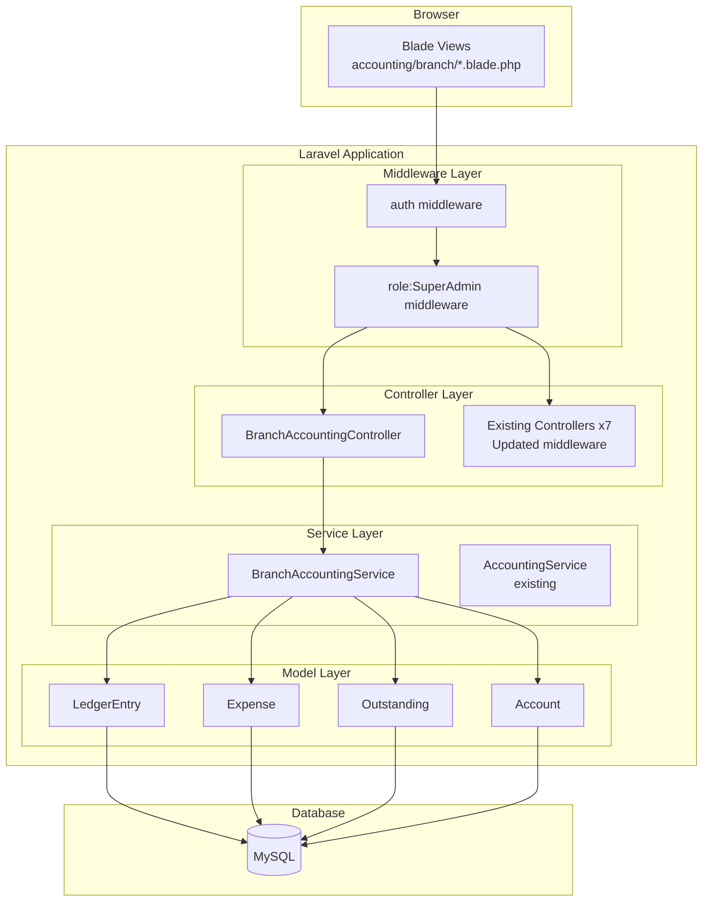
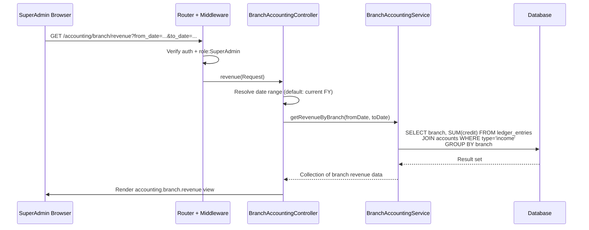

# Design Document: Branch Accounting (Phase 10)

## Overview

Phase 10 adds branch-level financial reporting to the SXpress Accounting Module. It consists of two parts:

**Part A — Access Control Tightening:** Update all existing accounting routes and controller constructors to enforce `role:SuperAdmin` middleware exclusively, removing the current `SuperAdmin|Admin|Manager` access.

**Part B — Branch Accounting Reports:** A new `BranchAccountingController` providing consolidated and per-branch views for revenue, expenses, profitability, cash position, and outstanding — all accessible only to SuperAdmin.

The system leverages existing data already tagged with `branch` columns across `ledger_entries`, `expenses`, and `outstanding` tables. No schema changes are required.

## Architecture

### High-Level Component Diagram



### Data Flow Diagram



## Components and Interfaces

### Part A: Middleware Updates

**Files Modified:**
- `routes/web.php` — Change `role:SuperAdmin|Admin|Manager` to `role:SuperAdmin` for all accounting route groups
- 6 controller constructors (LedgerController, VoucherController, CashBookController, BankBookController, OutstandingController, ExpenseController) — Update `$this->middleware()` call from `role:SuperAdmin|Admin|Manager` to `role:SuperAdmin`
- AccountController already uses `role:SuperAdmin` — no change needed

### Part B: New Components

#### 1. BranchAccountingService

**Location:** `app/Services/BranchAccountingService.php`

Encapsulates all branch-level aggregation queries. Keeps the controller thin and logic testable.

```php
class BranchAccountingService
{
    // All 7 branches as constant
    const BRANCHES = [
        'Rajkot', 'Navagam', 'Shapar (1)', 'Shapar (2)',
        'Dayabasti', 'Kashmore Gate', 'Swarup Nagar'
    ];

    public function getRevenueByBranch(string $fromDate, string $toDate): Collection;
    public function getRevenueDetailForBranch(string $branch, string $fromDate, string $toDate): Collection;
    public function getExpensesByBranch(string $fromDate, string $toDate): Collection;
    public function getExpenseDetailForBranch(string $branch, string $fromDate, string $toDate): Collection;
    public function getProfitabilityByBranch(string $fromDate, string $toDate): Collection;
    public function getCashPositionByBranch(string $fromDate, string $toDate): Collection;
    public function getOutstandingByBranch(?string $fromDate, ?string $toDate): Collection;
    public function getOutstandingDetailForBranch(string $branch, ?string $fromDate, ?string $toDate): LengthAwarePaginator;
    public function getDashboardMetrics(string $fromDate, string $toDate): array;
    public function resolveFinancialYearDates(): array; // Returns [from_date, to_date]
}
```

#### 2. BranchAccountingController

**Location:** `app/Http/Controllers/Accounting/BranchAccountingController.php`

```php
class BranchAccountingController extends Controller
{
    use OfficeScopeTrait;

    public function __construct(BranchAccountingService $service)
    {
        $this->middleware(['auth', 'role:SuperAdmin']);
    }

    public function dashboard(Request $request): View;
    public function revenue(Request $request): View;
    public function expenses(Request $request): View;
    public function profitability(Request $request): View;
    public function cashPosition(Request $request): View;
    public function outstanding(Request $request): View;
}
```

#### 3. Route Registration

**Location:** `routes/web.php` — New route group appended after existing accounting routes.

```php
Route::middleware(['role:SuperAdmin'])->prefix('accounting/branch')->name('accounting.branch.')->group(function () {
    Route::get('/', [BranchAccountingController::class, 'dashboard'])->name('dashboard');
    Route::get('/revenue', [BranchAccountingController::class, 'revenue'])->name('revenue');
    Route::get('/expenses', [BranchAccountingController::class, 'expenses'])->name('expenses');
    Route::get('/profitability', [BranchAccountingController::class, 'profitability'])->name('profitability');
    Route::get('/cash-position', [BranchAccountingController::class, 'cashPosition'])->name('cash-position');
    Route::get('/outstanding', [BranchAccountingController::class, 'outstanding'])->name('outstanding');
});
```

#### 4. Blade Views

**Location:** `resources/views/accounting/branch/`

| File | Purpose |
|------|---------|
| `_nav.blade.php` | Navigation partial with active state |
| `_filter.blade.php` | Date range filter partial |
| `dashboard.blade.php` | Summary cards for all branches |
| `revenue.blade.php` | Revenue comparison + drill-down |
| `expenses.blade.php` | Expense breakdown by type + drill-down |
| `profitability.blade.php` | Revenue vs expenses comparison |
| `cash-position.blade.php` | Cash balances per branch |
| `outstanding.blade.php` | Receivables/payables per branch |

#### 5. Navigation Partial (`_nav.blade.php`)

Renders a Bootstrap 5 `nav-pills` bar with links to all 6 reports. Uses `request()->routeIs()` to apply `active` class.

```blade
<ul class="nav nav-pills mb-3">
    <li class="nav-item">
        <a class="nav-link {{ request()->routeIs('accounting.branch.dashboard') ? 'active' : '' }}"
           href="{{ route('accounting.branch.dashboard') }}">Dashboard</a>
    </li>
    {{-- ... remaining items --}}
</ul>
```

## Data Models

No new database tables or migrations are required. All data already exists with branch tagging.

### Query Patterns

**Revenue Calculation:**
```sql
SELECT le.branch, SUM(le.credit) as total_revenue
FROM ledger_entries le
JOIN accounts a ON le.account_id = a.id
WHERE a.type = 'income'
  AND le.date BETWEEN :from_date AND :to_date
GROUP BY le.branch
```

**Expense Calculation:**
```sql
SELECT branch, expense_type, COUNT(*) as count, SUM(amount) as total
FROM expenses
WHERE status != 'rejected'
  AND expense_date BETWEEN :from_date AND :to_date
GROUP BY branch, expense_type
```

**Cash Position:**
```sql
-- Opening balance for a branch (entries before from_date)
SELECT
    COALESCE(SUM(debit), 0) as total_debit,
    COALESCE(SUM(credit), 0) as total_credit
FROM ledger_entries le
JOIN accounts a ON le.account_id = a.id
WHERE a.code IN ('1101', '1102')
  AND le.branch = :branch
  AND le.date < :from_date

-- Period activity (within date range)
SELECT
    COALESCE(SUM(debit), 0) as receipts,
    COALESCE(SUM(credit), 0) as payments
FROM ledger_entries le
JOIN accounts a ON le.account_id = a.id
WHERE a.code IN ('1101', '1102')
  AND le.branch = :branch
  AND le.date BETWEEN :from_date AND :to_date
```

**Outstanding:**
```sql
SELECT branch, type,
    SUM(pending_amount) as total_pending,
    COUNT(*) as entry_count
FROM outstanding
WHERE status != 'paid'
  AND (:from_date IS NULL OR invoice_date >= :from_date)
  AND (:to_date IS NULL OR invoice_date <= :to_date)
GROUP BY branch, type
```

### Financial Year Resolution Logic

```php
public function resolveFinancialYearDates(): array
{
    $today = Carbon::today();
    // Indian financial year: April 1 – March 31
    if ($today->month >= 4) {
        $from = Carbon::create($today->year, 4, 1);
        $to = Carbon::create($today->year + 1, 3, 31);
    } else {
        $from = Carbon::create($today->year - 1, 4, 1);
        $to = Carbon::create($today->year, 3, 31);
    }
    return [$from->format('Y-m-d'), $to->format('Y-m-d')];
}
```

### Date Range Resolution (Controller Helper)

Each controller method resolves dates as follows:
- If `from_date` and `to_date` are present in the request → use them
- If absent → default to current financial year for dashboard/revenue/expenses/profitability/cash-position; show all for outstanding

## Correctness Properties

*A property is a characteristic or behavior that should hold true across all valid executions of a system — essentially, a formal statement about what the system should do. Properties serve as the bridge between human-readable specifications and machine-verifiable correctness guarantees.*

### Property 1: Non-SuperAdmin Access Denial

*For any* authenticated user who does not hold the SuperAdmin role, requesting any route under the `/accounting` prefix (including `/accounting/branch/*`) SHALL result in an HTTP 403 response.

**Validates: Requirements 1.2, 8.3**

### Property 2: Profitability Calculation Correctness

*For any* branch and date range, the profitability report SHALL compute revenue as the sum of credit amounts from ledger entries associated with income-type accounts within that range, expenses as the sum of amounts from non-rejected expenses within that range, and net profit as revenue minus expenses. When revenue is greater than zero, profit margin SHALL equal ((revenue - expenses) / revenue) × 100 rounded to two decimal places.

**Validates: Requirements 2.2, 3.2, 5.2, 5.3**

### Property 3: Date Range Filtering

*For any* date range [from_date, to_date] applied to any branch report, the result set SHALL include only records whose relevant date column (ledger_entries.date, expenses.expense_date, or outstanding.invoice_date) falls within the inclusive range, and SHALL exclude all records outside it.

**Validates: Requirements 2.3, 3.4, 4.4, 5.5, 6.3, 7.5**

### Property 4: Consolidated Totals Invariant

*For any* set of branch metrics displayed on any report (dashboard, revenue, expenses, cash position), the consolidated totals row SHALL equal the arithmetic sum of the corresponding metric across all individual branch rows.

**Validates: Requirements 2.5, 3.6, 4.6, 6.5**

### Property 5: Branch Filtering Isolation

*For any* branch selection on a detail view (revenue drill-down, expense drill-down, or outstanding detail), the returned records SHALL all have their branch field equal to the selected branch, and no record from any other branch SHALL appear.

**Validates: Requirements 3.3, 4.3, 7.4**

### Property 6: Status Exclusion

*For any* query to the expense report, records with status 'rejected' SHALL be excluded. *For any* query to the outstanding report, records with status 'paid' SHALL be excluded. No excluded record SHALL contribute to any aggregation or appear in any detail view.

**Validates: Requirements 4.1, 7.2**

### Property 7: Cash Position Balance Equation

*For any* branch and date range, the closing cash balance SHALL equal the opening balance (account opening_balance + sum of debits − sum of credits for entries before from_date) plus total receipts (sum of debits within range) minus total payments (sum of credits within range), computed over cash accounts (codes 1101, 1102).

**Validates: Requirements 6.2**

## Error Handling

| Scenario | Handling |
|----------|----------|
| Non-SuperAdmin access attempt | Middleware returns 403 via spatie/laravel-permission's `UnauthorizedException` → renders `errors/403.blade.php` |
| Unauthenticated access | `auth` middleware redirects to `/login` |
| Invalid date range (to_date < from_date) | Controller validates and redirects back with error flash message |
| No data for selected filters | Views display "No records found" messages with the table structure intact |
| Database query failure | Standard Laravel exception handler; logged via `Log::error()` |
| Branch with zero revenue (division by zero) | Code guards: `$margin = $revenue > 0 ? round((...) * 100, 2) : 0` |

## Testing Strategy

### Unit Tests (Example-Based)

Unit tests verify specific scenarios and edge cases:

- **Access Control:** Test that Admin, Manager, Staff, Viewer all get 403 on accounting routes. Test that unauthenticated users get redirected to login.
- **Default Date Range:** Verify financial year calculation returns correct April 1 – March 31 boundaries.
- **Empty States:** Verify zero values displayed when branch has no data.
- **Edge Cases:** Zero revenue → 0% margin; invalid date range → error message; SuperAdmin with additional roles → access granted.
- **Navigation Active State:** Each page highlights its own nav link.

### Property-Based Tests

Property-based tests verify universal correctness guarantees using [pestphp/pest](https://pestphp.com/) with a custom data generator approach (seeding random data and asserting properties hold).

**Configuration:**
- Minimum 100 iterations per property test
- Each test tagged with the property it validates
- Tag format: `Feature: branch-accounting-phase10, Property {N}: {title}`

**Properties to implement:**
1. Non-SuperAdmin access denial (generate random non-SuperAdmin roles)
2. Profitability calculation correctness (generate random ledger entries + expenses)
3. Date range filtering (generate entries across date spectrum, verify filtering)
4. Consolidated totals invariant (generate multi-branch data, verify sums)
5. Branch filtering isolation (generate multi-branch data, verify isolation)
6. Status exclusion (generate records with various statuses, verify exclusion)
7. Cash position balance equation (generate cash transactions, verify equation)

### Integration Tests

- Full HTTP request tests through middleware → controller → database → view response
- Verify correct Blade templates are rendered with expected data structure
- Test pagination (30 per page) on outstanding detail view
- Test query parameter retention after filter submission

### Test Location

All tests in `tests/Feature/BranchAccountingTest.php` and `tests/Feature/BranchAccountingPropertyTest.php`.
