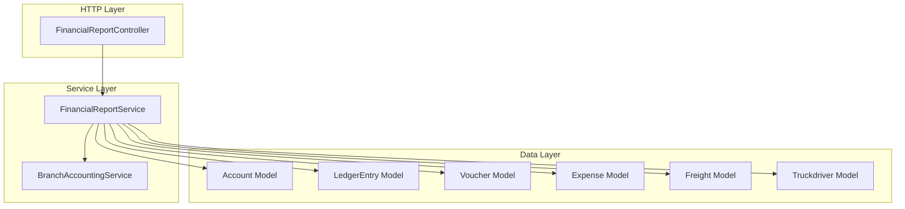

# Design Document: Phase 12 — Financial Reporting System

## Overview

Phase 12 introduces a formal Financial Reporting System to the SXpress Accounting Module. It provides six core reports — Day Book, Trial Balance, Profit & Loss Statement, Balance Sheet, Vehicle Profitability Report, and Driver Expense Report — all accessible exclusively by the SuperAdmin role.

The system follows the existing architectural patterns established in Phases 1–11:
- A dedicated `FinancialReportService` encapsulates all report calculation logic
- A `FinancialReportController` handles HTTP requests and delegates to the service
- Routes are registered under `/accounting/reports` with `role:SuperAdmin` middleware
- Blade views extend `admin.layout.master` and use Bootstrap 5 tables
- Indian Financial Year (April 1 – March 31) is the default date range
- All monetary values use Indian number formatting (₹1,00,000.00)

**Design Rationale:** Separating report logic into a dedicated service (rather than extending `BranchAccountingService`) keeps the existing branch reporting code stable and allows the financial reporting queries — which involve complex account-type-aware aggregations — to be independently testable and maintainable.

## Architecture



**Request Flow:**
1. SuperAdmin navigates to `/accounting/reports/{report-type}`
2. `FinancialReportController` validates date inputs, resolves defaults via `BranchAccountingService::resolveFinancialYearDates()`
3. Controller delegates to `FinancialReportService` method for the specific report
4. Service executes aggregation queries against the database
5. Controller passes data to the Blade view for rendering

## Components and Interfaces

### FinancialReportService

**Location:** `app/Services/FinancialReportService.php`

```php
<?php

namespace App\Services;

use Illuminate\Support\Collection;

class FinancialReportService
{
    private BranchAccountingService $branchService;

    public function __construct(BranchAccountingService $branchService)
    {
        $this->branchService = $branchService;
    }

    /**
     * Day Book: All vouchers and their entries for a specific date.
     *
     * @param string      $date   Y-m-d
     * @param string|null $branch Filter by branch (null = all)
     * @return array{vouchers: Collection, totals: array{debit: float, credit: float}}
     */
    public function getDayBook(string $date, ?string $branch = null): array;

    /**
     * Trial Balance: All accounts with debit/credit totals for a period.
     *
     * @param string      $fromDate Y-m-d
     * @param string      $toDate   Y-m-d
     * @param string|null $branch   Filter by branch (null = all)
     * @return array{accounts: Collection, totals: array{debit: float, credit: float}}
     */
    public function getTrialBalance(string $fromDate, string $toDate, ?string $branch = null): array;

    /**
     * Profit & Loss Statement: Income vs Expense for a period.
     *
     * @param string      $fromDate Y-m-d
     * @param string      $toDate   Y-m-d
     * @param string|null $branch   Filter by branch (null = all)
     * @return array{
     *   income: Collection,
     *   expenses: Collection,
     *   total_income: float,
     *   total_expenses: float,
     *   net_profit: float
     * }
     */
    public function getProfitAndLoss(string $fromDate, string $toDate, ?string $branch = null): array;

    /**
     * Balance Sheet: Assets = Liabilities + Equity as of a date.
     *
     * @param string      $asOfDate Y-m-d
     * @param string|null $branch   Filter by branch (null = all)
     * @return array{
     *   assets: Collection,
     *   liabilities: Collection,
     *   equity: Collection,
     *   net_profit: float,
     *   total_assets: float,
     *   total_liabilities_equity: float
     * }
     */
    public function getBalanceSheet(string $asOfDate, ?string $branch = null): array;

    /**
     * Vehicle Profitability: Revenue vs expenses per vehicle.
     *
     * @param string      $fromDate Y-m-d
     * @param string      $toDate   Y-m-d
     * @param string|null $branch   Filter by branch (null = all)
     * @return array{vehicles: Collection, totals: array{revenue: float, expenses: float, net_profit: float}}
     */
    public function getVehicleProfitability(string $fromDate, string $toDate, ?string $branch = null): array;

    /**
     * Driver Expense Report: Expenses grouped by driver.
     *
     * @param string      $fromDate Y-m-d
     * @param string      $toDate   Y-m-d
     * @param string|null $branch   Filter by branch (null = all)
     * @return array{drivers: Collection, total_expenses: float}
     */
    public function getDriverExpenses(string $fromDate, string $toDate, ?string $branch = null): array;

    /**
     * Calculate net profit for a period (used by Balance Sheet).
     * Total Income credits - Total Expense debits for the FY up to asOfDate.
     */
    private function calculateNetProfit(string $fromDate, string $toDate, ?string $branch = null): float;

    /**
     * Get account balance considering opening_balance + ledger movements.
     * For asset/expense: opening + debit - credit
     * For liability/income/equity: opening + credit - debit
     */
    private function getAccountBalance(int $accountId, string $fromDate, string $toDate, ?string $branch = null): float;
}
```

### FinancialReportController

**Location:** `app/Http/Controllers/Accounting/FinancialReportController.php`

```php
<?php

namespace App\Http\Controllers\Accounting;

use App\Http\Controllers\Controller;
use App\Services\FinancialReportService;
use App\Services\BranchAccountingService;
use Illuminate\Http\Request;

class FinancialReportController extends Controller
{
    private FinancialReportService $reportService;
    private BranchAccountingService $branchService;

    public function __construct(
        FinancialReportService $reportService,
        BranchAccountingService $branchService
    ) {
        $this->middleware(['auth', 'role:SuperAdmin']);
        $this->reportService = $reportService;
        $this->branchService = $branchService;
    }

    public function index();            // Reports index page
    public function dayBook(Request $request);
    public function trialBalance(Request $request);
    public function profitAndLoss(Request $request);
    public function balanceSheet(Request $request);
    public function vehicleProfitability(Request $request);
    public function driverExpenses(Request $request);
}
```

### Routes

**Registered in:** `routes/web.php` (within existing SuperAdmin middleware group)

```php
// Financial Reports — SuperAdmin only
Route::middleware(['role:SuperAdmin'])->prefix('accounting/reports')->name('accounting.reports.')->group(function () {
    Route::get('/', [FinancialReportController::class, 'index'])->name('index');
    Route::get('/day-book', [FinancialReportController::class, 'dayBook'])->name('day-book');
    Route::get('/trial-balance', [FinancialReportController::class, 'trialBalance'])->name('trial-balance');
    Route::get('/profit-and-loss', [FinancialReportController::class, 'profitAndLoss'])->name('profit-and-loss');
    Route::get('/balance-sheet', [FinancialReportController::class, 'balanceSheet'])->name('balance-sheet');
    Route::get('/vehicle-profitability', [FinancialReportController::class, 'vehicleProfitability'])->name('vehicle-profitability');
    Route::get('/driver-expenses', [FinancialReportController::class, 'driverExpenses'])->name('driver-expenses');
});
```

### Blade Views

**Location:** `resources/views/accounting/reports/`

| View File | Purpose |
|-----------|---------|
| `index.blade.php` | Reports dashboard with navigation cards |
| `day-book.blade.php` | Day Book with date picker and branch filter |
| `trial-balance.blade.php` | Trial Balance grouped by account type |
| `profit-and-loss.blade.php` | P&L with income/expense sections |
| `balance-sheet.blade.php` | T-format Balance Sheet |
| `vehicle-profitability.blade.php` | Vehicle revenue vs expenses table |
| `driver-expenses.blade.php` | Driver expenses with type breakdown |
| `_filters.blade.php` | Reusable partial: date range + branch filter |
| `_print-header.blade.php` | Reusable partial: company header for print |

All views extend `@extends('admin.layout.master')` and use Bootstrap 5 table components.

### Indian Number Formatting Helper

**Location:** `app/Helpers/NumberHelper.php` (or a Blade directive)

```php
/**
 * Format a number in Indian numbering system: 1,00,000.00
 */
function indianNumberFormat(float $number, int $decimals = 2): string
{
    $negative = $number < 0;
    $number = abs($number);
    $intPart = (int) $number;
    $decPart = round($number - $intPart, $decimals);

    $intStr = (string) $intPart;
    $result = '';

    if (strlen($intStr) > 3) {
        $result = substr($intStr, -3);
        $remaining = substr($intStr, 0, -3);
        while (strlen($remaining) > 2) {
            $result = substr($remaining, -2) . ',' . $result;
            $remaining = substr($remaining, 0, -2);
        }
        $result = $remaining . ',' . $result;
    } else {
        $result = $intStr;
    }

    $formatted = $result . '.' . str_pad((string)($decPart * pow(10, $decimals)), $decimals, '0', STR_PAD_LEFT);
    return ($negative ? '-' : '') . $formatted;
}
```

## Data Models

No new database tables or migrations are required. This phase reads from existing tables:

### Query Patterns

#### Trial Balance Query

```sql
-- For each transactional account, calculate: opening_balance + period movements
SELECT
    a.id, a.code, a.name, a.type, a.opening_balance,
    COALESCE(SUM(le.debit), 0) as total_debit,
    COALESCE(SUM(le.credit), 0) as total_credit
FROM accounts a
LEFT JOIN ledger_entries le ON le.account_id = a.id
    AND le.date BETWEEN :from_date AND :to_date
    [AND le.branch = :branch]
WHERE a.is_group = 0 AND a.is_active = 1
GROUP BY a.id, a.code, a.name, a.type, a.opening_balance
HAVING (a.opening_balance + COALESCE(SUM(le.debit), 0) - COALESCE(SUM(le.credit), 0)) != 0
   OR (a.opening_balance + COALESCE(SUM(le.credit), 0) - COALESCE(SUM(le.debit), 0)) != 0
ORDER BY a.type, a.code
```

**Balance calculation per account type:**
- Asset/Expense (debit-normal): `balance = opening_balance + total_debit - total_credit`
- Liability/Income/Equity (credit-normal): `balance = opening_balance + total_credit - total_debit`

**Display logic:**
- If balance > 0 for debit-normal account → show in Debit column
- If balance > 0 for credit-normal account → show in Credit column
- If balance < 0 → show absolute value in the opposite column

#### Profit & Loss Query

```sql
-- Income accounts (credit-normal, balance = credit - debit for period only)
SELECT a.id, a.code, a.name, a.parent_id,
    COALESCE(SUM(le.credit), 0) - COALESCE(SUM(le.debit), 0) as balance
FROM accounts a
LEFT JOIN ledger_entries le ON le.account_id = a.id
    AND le.date BETWEEN :from_date AND :to_date
    [AND le.branch = :branch]
WHERE a.type = 'income' AND a.is_group = 0 AND a.is_active = 1
GROUP BY a.id, a.code, a.name, a.parent_id
HAVING balance != 0

-- Expense accounts (debit-normal, balance = debit - credit for period only)
SELECT a.id, a.code, a.name, a.parent_id,
    COALESCE(SUM(le.debit), 0) - COALESCE(SUM(le.credit), 0) as balance
FROM accounts a
LEFT JOIN ledger_entries le ON le.account_id = a.id
    AND le.date BETWEEN :from_date AND :to_date
    [AND le.branch = :branch]
WHERE a.type = 'expense' AND a.is_group = 0 AND a.is_active = 1
GROUP BY a.id, a.code, a.name, a.parent_id
HAVING balance != 0
```

**Note:** P&L uses only the period movements (no opening_balance), since it reports period performance.

#### Balance Sheet Query

```sql
-- Asset accounts: opening + all movements up to asOfDate
SELECT a.id, a.code, a.name, a.parent_id, a.opening_balance,
    COALESCE(SUM(le.debit), 0) as total_debit,
    COALESCE(SUM(le.credit), 0) as total_credit
FROM accounts a
LEFT JOIN ledger_entries le ON le.account_id = a.id
    AND le.date <= :as_of_date
    [AND le.branch = :branch]
WHERE a.type = 'asset' AND a.is_group = 0 AND a.is_active = 1
GROUP BY a.id, a.code, a.name, a.parent_id, a.opening_balance
-- balance = opening_balance + total_debit - total_credit

-- Liability accounts: opening + all movements up to asOfDate
-- balance = opening_balance + total_credit - total_debit

-- Equity accounts: opening + all movements up to asOfDate
-- balance = opening_balance + total_credit - total_debit
```

**Balance Sheet Equation:** `Total Assets = Total Liabilities + Total Equity + Current Period Net Profit`

The current period net profit is calculated as: total income credits minus total expense debits from the start of the current FY to the as-of date.

#### Vehicle Profitability Query

```sql
-- Revenue per vehicle (from frieghts table via truck_id)
SELECT
    v.id, v.vehicle_number,
    COALESCE(SUM(f.truck_freight), 0) as total_revenue
FROM vehicles v
INNER JOIN frieghts f ON f.truck_id = v.id
WHERE f.fm_date BETWEEN :from_date AND :to_date
    [AND f.office = :branch]
GROUP BY v.id, v.vehicle_number

-- Expenses per vehicle (from expenses table via vehicle_id)
SELECT
    e.vehicle_id,
    e.expense_type,
    COALESCE(SUM(e.amount), 0) as type_total
FROM expenses e
WHERE e.vehicle_id IS NOT NULL
    AND e.status IN ('approved', 'paid')
    AND e.expense_date BETWEEN :from_date AND :to_date
    [AND e.branch = :branch]
GROUP BY e.vehicle_id, e.expense_type
```

**Join logic:** Revenue comes from `frieghts.truck_id → vehicles.id`, expenses from `expenses.vehicle_id → vehicles.id`. Both are aggregated per vehicle and combined in PHP.

#### Driver Expense Query

```sql
-- Expenses per driver (from expenses table via driver_id)
SELECT
    td.id, td.driver_name, td.truck_no,
    e.expense_type,
    COUNT(*) as expense_count,
    COALESCE(SUM(e.amount), 0) as type_total
FROM expenses e
INNER JOIN truckdrivers td ON td.id = e.driver_id
WHERE e.driver_id IS NOT NULL
    AND e.status IN ('approved', 'paid')
    AND e.expense_date BETWEEN :from_date AND :to_date
    [AND e.branch = :branch]
GROUP BY td.id, td.driver_name, td.truck_no, e.expense_type
ORDER BY type_total DESC
```

**Join logic:** Expenses link to drivers via `expenses.driver_id → truckdrivers.id`. The `truck_no` field on `truckdrivers` provides the associated truck number.


## Correctness Properties

*A property is a characteristic or behavior that should hold true across all valid executions of a system — essentially, a formal statement about what the system should do. Properties serve as the bridge between human-readable specifications and machine-verifiable correctness guarantees.*

### Property 1: Trial Balance Balancing Invariant

*For any* valid set of double-entry vouchers and any valid date range, the total of the debit column in the Trial Balance SHALL equal the total of the credit column.

**Validates: Requirements 2.6**

### Property 2: Balance Sheet Accounting Equation

*For any* valid set of double-entry vouchers and any valid as-of date, the total of Assets SHALL equal the total of Liabilities plus Equity plus current period Net Profit (Total Income minus Total Expenses from FY start to as-of date).

**Validates: Requirements 4.6**

### Property 3: Trial Balance Correct Balance Placement

*For any* transactional account with a non-zero balance, if the account is debit-normal (asset or expense) then a positive balance SHALL appear in the debit column, and if the account is credit-normal (liability, income, or equity) then a positive balance SHALL appear in the credit column. Negative balances SHALL appear in the opposite column as absolute values.

**Validates: Requirements 2.1, 2.2, 2.3, 2.4**

### Property 4: Profit & Loss Net Profit Calculation

*For any* valid date range and set of ledger entries, the Net Profit SHALL equal the sum of all credit balances for income-type accounts minus the sum of all debit balances for expense-type accounts within that period.

**Validates: Requirements 3.1, 3.2, 3.3, 3.4, 3.5**

### Property 5: Vehicle Profitability Per-Vehicle Net Calculation

*For any* vehicle with activity in a period, the reported net profit SHALL equal the sum of `truck_freight` from freight memos linked via `truck_id` minus the sum of `amount` from approved/paid expenses linked via `vehicle_id` for that period.

**Validates: Requirements 5.2, 5.3, 5.5**

### Property 6: Summary Row Equals Sum of Parts

*For any* report displaying a summary row (Vehicle Profitability or Driver Expenses), the summary totals SHALL equal the sum of the corresponding values across all individual rows in the report.

**Validates: Requirements 5.4, 5.6, 6.3, 6.4**

### Property 7: Branch Filter Isolation

*For any* report and any selected branch, all data items in the filtered report SHALL belong exclusively to the selected branch. No data item from a different branch SHALL appear in the results.

**Validates: Requirements 1.3, 2.7, 3.7, 4.7, 5.7, 6.5**

### Property 8: Indian Number Format Correctness

*For any* non-negative number, the Indian number format function SHALL produce output matching the pattern where the last three digits are grouped together and all preceding digits are grouped in pairs separated by commas, followed by exactly two decimal places (e.g., `1,23,45,678.90`).

**Validates: Requirements 7.7**

### Property 9: Descending Sort Order

*For any* Vehicle Profitability Report or Driver Expense Report result set, each item's sort value (net profit or total expense respectively) SHALL be greater than or equal to the next item's sort value.

**Validates: Requirements 5.8, 6.6**

### Property 10: Day Book Date Filter Completeness

*For any* date, the Day Book report SHALL include all approved vouchers whose `voucher_date` matches the selected date, and SHALL exclude all vouchers whose `voucher_date` does not match.

**Validates: Requirements 1.2**

## Error Handling

| Scenario | Handling | User Feedback |
|----------|----------|---------------|
| Invalid date range (to_date < from_date) | Controller validates before calling service | Redirect back with flash error message |
| No data for selected filters | Service returns empty collections | View displays "No records found" message |
| Invalid branch parameter | Controller validates against `BRANCHES` constant | Redirect back with error or ignore invalid value |
| Database query failure | Exception bubbles up to Laravel handler | Generic 500 error page |
| Non-SuperAdmin access attempt | `role:SuperAdmin` middleware intercepts | HTTP 403 Forbidden response |
| Unauthenticated access | `auth` middleware redirects | Redirect to login page |
| Missing date parameters | Controller uses FY defaults via `resolveFinancialYearDates()` | Report generates with default dates |
| Account with null opening_balance | Treat as 0.0 in calculations | No user-facing error |
| Division by zero (profit margin) | Check divisor before division | Display 0% or N/A |

**Date Validation Pattern** (consistent with existing `BranchAccountingController`):

```php
if ($toDate < $fromDate) {
    return redirect()->back()->with('error', 'Invalid date range: "To Date" cannot be before "From Date".');
}
```

## Testing Strategy

### Unit Tests (Example-Based)

Unit tests cover specific scenarios, edge cases, and integration points:

| Test | What it verifies |
|------|-----------------|
| Day Book shows vouchers for today by default | Requirement 1.1 |
| Day Book groups entries by voucher | Requirement 1.6 |
| Empty Day Book shows "no transactions" message | Requirement 1.4 |
| Trial Balance groups accounts by type | Requirement 2.9 |
| P&L defaults to Indian FY | Requirement 3.9 |
| P&L layout has income before expenses | Requirement 3.6 |
| Balance Sheet defaults to today | Requirement 4.9 |
| Balance Sheet T-format structure | Requirement 4.5 |
| Vehicle with zero activity is excluded | Requirement 5.9 |
| Driver with zero expenses is excluded | Requirement 6.7 |
| Driver output includes truck number | Requirement 6.8 |
| SuperAdmin access allowed (each route) | Requirement 7.1 |
| Non-SuperAdmin gets 403 (each route) | Requirement 7.2 |
| Routes registered under accounting.reports.* | Requirement 7.3 |
| Reports index lists all 6 reports | Requirement 7.4 |
| Print view hides navigation | Requirement 8.3 |
| Print view includes company header and timestamp | Requirement 8.2 |

### Property-Based Tests

Property-based tests verify universal properties across randomly generated inputs. Each property test runs a minimum of 100 iterations.

**Library:** [PHPUnit with `phpunit/phpunit` + custom data providers generating random accounting data]

Alternatively, if a PHP PBT library like `innmind/black-box` or `eris/eris` is available in the project, use that. Otherwise, implement randomized data providers with configurable iteration count.

| Property Test | Design Property | Tag |
|---|---|---|
| Trial Balance total debits = total credits | Property 1 | Feature: financial-reports-phase12, Property 1: Trial Balance Balancing Invariant |
| Balance Sheet A = L + E + NP | Property 2 | Feature: financial-reports-phase12, Property 2: Balance Sheet Accounting Equation |
| Balance placement by account type | Property 3 | Feature: financial-reports-phase12, Property 3: Trial Balance Correct Balance Placement |
| P&L net profit = income - expenses | Property 4 | Feature: financial-reports-phase12, Property 4: P&L Net Profit Calculation |
| Vehicle net = freight revenue - expenses | Property 5 | Feature: financial-reports-phase12, Property 5: Vehicle Profitability Per-Vehicle Net Calculation |
| Summary row = sum of individual rows | Property 6 | Feature: financial-reports-phase12, Property 6: Summary Row Equals Sum of Parts |
| Branch filter shows only selected branch data | Property 7 | Feature: financial-reports-phase12, Property 7: Branch Filter Isolation |
| Indian format matches expected pattern | Property 8 | Feature: financial-reports-phase12, Property 8: Indian Number Format Correctness |
| Results sorted in descending order | Property 9 | Feature: financial-reports-phase12, Property 9: Descending Sort Order |
| Day Book includes only matching-date vouchers | Property 10 | Feature: financial-reports-phase12, Property 10: Day Book Date Filter Completeness |

**Test Data Generation Strategy:**

For properties 1, 2, 3, 4: Generate random accounts of each type with random opening balances, then generate random balanced voucher sets (ensuring each voucher's total debit = total credit). This mirrors how the `AccountingService::createVoucher()` enforces balance.

For properties 5, 6: Generate random vehicles, random freight records linked via `truck_id`, and random expenses linked via `vehicle_id` with various statuses.

For property 7: Generate data items with random branch assignments, select a random branch filter, verify isolation.

For property 8: Generate random float values (including large numbers like 10,00,00,000.50) and verify format with regex `^\d{1,2}(,\d{2})*(,\d{3})\.\d{2}$` or similar.

For property 9: Generate random numeric values, sort descending, verify each element ≥ next.

### Integration Tests

| Test | Scope |
|------|-------|
| Full request cycle for each report route | HTTP → Controller → Service → DB → View |
| Date range validation redirects with error | Controller middleware behavior |
| Branch filter dropdown populated with 7 branches | View rendering |
| Print view renders without navigation | View rendering |
