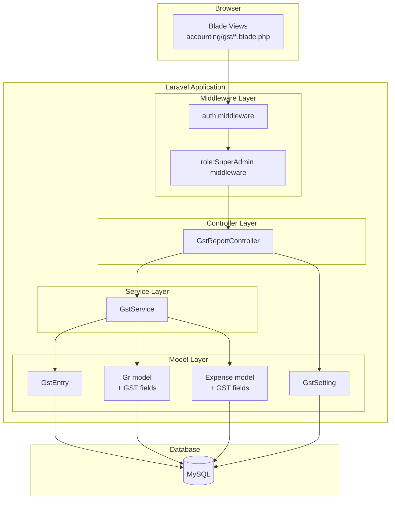
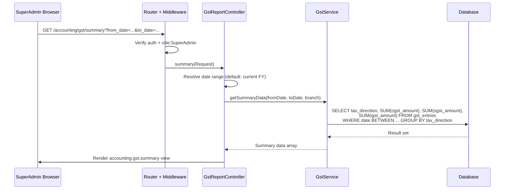
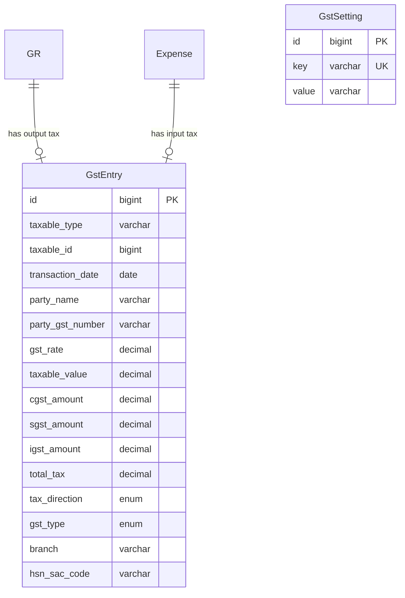

# Design Document: GST Support (Phase 11)

## Overview

Phase 11 adds GST (Goods and Services Tax) data storage and reporting to the SXpress Accounting Module. It introduces:

1. **Database migrations** — Add GST fields to `grs` and `expenses` tables; create a new `gst_entries` table for detailed tax records
2. **GstService** — Business logic for GST calculation, tax type determination, and report aggregation
3. **GstReportController** — Five report views (Summary, Collection, Liability, Input Tax, Output Tax)
4. **GST Settings** — Company GST number, default rate, and state stored in a settings table/config
5. **Blade Views** — Report pages under `resources/views/accounting/gst/`

This is reporting-only. No government filing, no GSTR form generation, no API integration with GST portal.

## Architecture

### High-Level Component Diagram



### Data Flow Diagram



## Components and Interfaces

### 1. Database Migrations

#### Migration 1: Add GST fields to `grs` table

```php
Schema::table('grs', function (Blueprint $table) {
    $table->decimal('gst_rate', 5, 2)->nullable()->after('total_amount');
    $table->enum('gst_type', ['cgst_sgst', 'igst'])->nullable()->after('gst_rate');
    $table->decimal('cgst_amount', 12, 2)->nullable()->default(0)->after('gst_type');
    $table->decimal('sgst_amount', 12, 2)->nullable()->default(0)->after('cgst_amount');
    $table->decimal('igst_amount', 12, 2)->nullable()->default(0)->after('sgst_amount');
    $table->decimal('gst_total', 12, 2)->nullable()->default(0)->after('igst_amount');
});
```

#### Migration 2: Add GST fields to `expenses` table

```php
Schema::table('expenses', function (Blueprint $table) {
    $table->decimal('gst_rate', 5, 2)->nullable()->after('amount');
    $table->enum('gst_type', ['cgst_sgst', 'igst'])->nullable()->after('gst_rate');
    $table->decimal('cgst_amount', 12, 2)->nullable()->default(0)->after('gst_type');
    $table->decimal('sgst_amount', 12, 2)->nullable()->default(0)->after('cgst_amount');
    $table->decimal('igst_amount', 12, 2)->nullable()->default(0)->after('sgst_amount');
    $table->decimal('gst_total', 12, 2)->nullable()->default(0)->after('igst_amount');
    $table->string('vendor_gst_number', 20)->nullable()->after('gst_total');
});
```

#### Migration 3: Create `gst_entries` table

```php
Schema::create('gst_entries', function (Blueprint $table) {
    $table->id();
    $table->morphs('taxable');  // taxable_type, taxable_id (polymorphic: Gr or Expense)
    $table->date('transaction_date');
    $table->string('party_name');
    $table->string('party_gst_number', 20)->nullable();
    $table->decimal('gst_rate', 5, 2);
    $table->decimal('taxable_value', 12, 2);
    $table->decimal('cgst_amount', 12, 2)->default(0);
    $table->decimal('sgst_amount', 12, 2)->default(0);
    $table->decimal('igst_amount', 12, 2)->default(0);
    $table->decimal('total_tax', 12, 2);
    $table->enum('tax_direction', ['output', 'input']);
    $table->enum('gst_type', ['cgst_sgst', 'igst']);
    $table->string('branch');
    $table->string('hsn_sac_code', 10)->nullable()->default('996511'); // SAC for GTA
    $table->timestamps();

    $table->index(['transaction_date', 'tax_direction']);
    $table->index(['branch', 'transaction_date']);
    $table->index('tax_direction');
});
```

#### Migration 4: Create `gst_settings` table

```php
Schema::create('gst_settings', function (Blueprint $table) {
    $table->id();
    $table->string('key')->unique();
    $table->string('value')->nullable();
    $table->timestamps();
});

// Seed default settings
DB::table('gst_settings')->insert([
    ['key' => 'company_gst_number', 'value' => null, 'created_at' => now(), 'updated_at' => now()],
    ['key' => 'default_gst_rate', 'value' => '5', 'created_at' => now(), 'updated_at' => now()],
    ['key' => 'company_state', 'value' => 'Gujarat', 'created_at' => now(), 'updated_at' => now()],
]);
```

### 2. GstEntry Model

**Location:** `app/Models/Accounting/GstEntry.php`

```php
class GstEntry extends Model
{
    protected $fillable = [
        'taxable_type', 'taxable_id', 'transaction_date', 'party_name',
        'party_gst_number', 'gst_rate', 'taxable_value', 'cgst_amount',
        'sgst_amount', 'igst_amount', 'total_tax', 'tax_direction',
        'gst_type', 'branch', 'hsn_sac_code',
    ];

    protected $casts = [
        'transaction_date' => 'date',
        'gst_rate'         => 'decimal:2',
        'taxable_value'    => 'decimal:2',
        'cgst_amount'      => 'decimal:2',
        'sgst_amount'      => 'decimal:2',
        'igst_amount'      => 'decimal:2',
        'total_tax'        => 'decimal:2',
    ];

    // Polymorphic relationship
    public function taxable() { return $this->morphTo(); }

    // Scopes
    public function scopeOutput($q) { return $q->where('tax_direction', 'output'); }
    public function scopeInput($q) { return $q->where('tax_direction', 'input'); }
    public function scopeForBranch($q, $branch) { return $q->where('branch', $branch); }
    public function scopeDateRange($q, $from, $to) { ... }
    public function scopeOfGstType($q, $type) { return $q->where('gst_type', $type); }
}
```

### 3. GstSetting Model

**Location:** `app/Models/Accounting/GstSetting.php`

```php
class GstSetting extends Model
{
    protected $fillable = ['key', 'value'];

    public static function get(string $key, $default = null): ?string
    {
        return static::where('key', $key)->value('value') ?? $default;
    }

    public static function set(string $key, ?string $value): void
    {
        static::updateOrCreate(['key' => $key], ['value' => $value]);
    }
}
```

### 4. GstService

**Location:** `app/Services/GstService.php`

```php
class GstService
{
    const VALID_RATES = [5, 12];
    const DEFAULT_HSN_SAC = '996511'; // SAC code for Goods Transport Agency

    /**
     * Determine GST type based on origin and destination states.
     * Same state = intra-state (CGST+SGST), different = inter-state (IGST)
     */
    public function determineGstType(string $originState, string $destinationState): string;

    /**
     * Calculate GST amounts for a given taxable value and rate.
     * Returns ['cgst_amount', 'sgst_amount', 'igst_amount', 'total_tax', 'gst_type']
     */
    public function calculateGst(float $taxableValue, float $rate, string $gstType): array;

    /**
     * Get GST summary data (output totals, input totals, net).
     */
    public function getSummaryData(string $fromDate, string $toDate, ?string $branch = null): array;

    /**
     * Get collection (output tax) report data with pagination.
     */
    public function getCollectionData(string $fromDate, string $toDate, ?string $branch = null, ?string $gstTypeFilter = null): LengthAwarePaginator;

    /**
     * Get liability report grouped by month.
     */
    public function getLiabilityData(string $fromDate, string $toDate): Collection;

    /**
     * Get input tax report data with pagination.
     */
    public function getInputTaxData(string $fromDate, string $toDate, ?string $branch = null, ?string $expenseType = null): LengthAwarePaginator;

    /**
     * Get output tax report grouped by GST type with pagination.
     */
    public function getOutputTaxData(string $fromDate, string $toDate, ?string $branch = null, ?string $rateFilter = null): LengthAwarePaginator;

    /**
     * Resolve the current Indian Financial Year boundaries.
     */
    public function resolveFinancialYearDates(): array;
}
```

#### Key Calculation Logic

```php
public function calculateGst(float $taxableValue, float $rate, string $gstType): array
{
    $totalTax = round($taxableValue * $rate / 100, 2);

    if ($gstType === 'igst') {
        return [
            'cgst_amount' => 0,
            'sgst_amount' => 0,
            'igst_amount' => $totalTax,
            'total_tax'   => $totalTax,
            'gst_type'    => 'igst',
        ];
    }

    // CGST + SGST split equally
    $half = round($totalTax / 2, 2);
    // Handle rounding: if 2*half != totalTax, adjust CGST
    $cgst = $totalTax - $half;
    $sgst = $half;

    return [
        'cgst_amount' => $cgst,
        'sgst_amount' => $sgst,
        'igst_amount' => 0,
        'total_tax'   => $totalTax,
        'gst_type'    => 'cgst_sgst',
    ];
}
```

### 5. GstReportController

**Location:** `app/Http/Controllers/Accounting/GstReportController.php`

```php
class GstReportController extends Controller
{
    private GstService $gstService;

    public function __construct(GstService $gstService)
    {
        $this->middleware(['auth', 'role:SuperAdmin']);
        $this->gstService = $gstService;
    }

    public function summary(Request $request): View;
    public function collection(Request $request): View;
    public function liability(Request $request): View;
    public function inputTax(Request $request): View;
    public function outputTax(Request $request): View;
    public function settings(Request $request): View;
    public function updateSettings(Request $request): RedirectResponse;
}
```

### 6. Route Registration

**Location:** `routes/web.php` — Appended after existing accounting route groups.

```php
// GST Reports — SuperAdmin only
Route::middleware(['role:SuperAdmin'])->prefix('accounting/gst')->name('accounting.gst.')->group(function () {
    Route::get('/', [GstReportController::class, 'summary'])->name('summary');
    Route::get('/collection', [GstReportController::class, 'collection'])->name('collection');
    Route::get('/liability', [GstReportController::class, 'liability'])->name('liability');
    Route::get('/input-tax', [GstReportController::class, 'inputTax'])->name('input-tax');
    Route::get('/output-tax', [GstReportController::class, 'outputTax'])->name('output-tax');
    Route::get('/settings', [GstReportController::class, 'settings'])->name('settings');
    Route::post('/settings', [GstReportController::class, 'updateSettings'])->name('settings.update');
});
```

### 7. Blade Views

**Location:** `resources/views/accounting/gst/`

| File | Purpose |
|------|---------|
| `_nav.blade.php` | GST sub-navigation with active state |
| `_filter.blade.php` | Date range + branch filter partial |
| `summary.blade.php` | Consolidated output/input/net table |
| `collection.blade.php` | Paginated list of GRs with GST collected |
| `liability.blade.php` | Monthly liability breakdown |
| `input-tax.blade.php` | Paginated expense-based input tax list |
| `output-tax.blade.php` | Output tax grouped by type/rate |
| `settings.blade.php` | Company GST settings form |

All views extend the existing accounting layout and use Bootstrap 5 tables, consistent with Phase 10 views.

### 8. Navigation Integration

Add a "GST Reports" section to the accounting sidebar navigation partial. The section contains links to all 5 reports plus settings. Active state is determined by `request()->routeIs('accounting.gst.*')`.

## Data Models

### Entity Relationship Diagram



### Query Patterns

**GST Summary (Output Totals):**
```sql
SELECT
    COALESCE(SUM(cgst_amount), 0) as total_cgst,
    COALESCE(SUM(sgst_amount), 0) as total_sgst,
    COALESCE(SUM(igst_amount), 0) as total_igst,
    COALESCE(SUM(total_tax), 0) as grand_total
FROM gst_entries
WHERE tax_direction = 'output'
  AND transaction_date BETWEEN :from_date AND :to_date
  AND (:branch IS NULL OR branch = :branch)
```

**GST Liability (Monthly):**
```sql
SELECT
    DATE_FORMAT(transaction_date, '%Y-%m') as month,
    tax_direction,
    SUM(cgst_amount) as cgst,
    SUM(sgst_amount) as sgst,
    SUM(igst_amount) as igst,
    SUM(total_tax) as total
FROM gst_entries
WHERE transaction_date BETWEEN :from_date AND :to_date
GROUP BY month, tax_direction
ORDER BY month
```

**Collection Report (Output with GR details):**
```sql
SELECT ge.*, g.gr_no, g.consignee, g.consignee_gst_no
FROM gst_entries ge
JOIN grs g ON ge.taxable_id = g.id AND ge.taxable_type = 'App\\Models\\Gr'
WHERE ge.tax_direction = 'output'
  AND ge.transaction_date BETWEEN :from_date AND :to_date
ORDER BY ge.transaction_date DESC
```

**Input Tax Report (with Expense details):**
```sql
SELECT ge.*, e.expense_no, e.expense_type, e.paid_to
FROM gst_entries ge
JOIN expenses e ON ge.taxable_id = e.id AND ge.taxable_type = 'App\\Models\\Accounting\\Expense'
WHERE ge.tax_direction = 'input'
  AND ge.transaction_date BETWEEN :from_date AND :to_date
ORDER BY ge.transaction_date DESC
```

## Correctness Properties

### Property 1: Tax Amount Mutual Exclusivity

*For all* GstEntry records, IF gst_type is "igst" THEN cgst_amount SHALL equal 0 AND sgst_amount SHALL equal 0 AND igst_amount SHALL equal total_tax. IF gst_type is "cgst_sgst" THEN igst_amount SHALL equal 0 AND cgst_amount plus sgst_amount SHALL equal total_tax.

**Validates: Requirements 1.5, 1.6, 4.2, 4.3**

### Property 2: Tax Calculation Accuracy

*For all* taxable values V and GST rates R, the total_tax SHALL equal round(V × R / 100, 2). For intra-state transactions, cgst_amount + sgst_amount SHALL equal total_tax. For inter-state transactions, igst_amount SHALL equal total_tax.

**Validates: Requirements 2.1, 2.2, 2.4**

### Property 3: CGST/SGST Symmetry

*For all* GstEntry records where gst_type is "cgst_sgst", the absolute difference between cgst_amount and sgst_amount SHALL be at most 0.01 (one paisa, due to rounding of odd amounts).

**Validates: Requirements 1.6, 2.1**

### Property 4: Total Tax Invariant

*For all* GstEntry records, total_tax SHALL equal cgst_amount + sgst_amount + igst_amount. This holds regardless of gst_type, rate, or taxable_value.

**Validates: Requirements 1.4**

### Property 5: State-Based Type Determination

*For all* pairs of origin state and destination state, IF origin equals destination THEN determineGstType SHALL return "cgst_sgst", ELSE it SHALL return "igst". The result SHALL be deterministic and idempotent.

**Validates: Requirements 2.1, 2.2, 2.5**

### Property 6: Summary Net Liability Calculation

*For any* date range and optional branch filter, the net liability for each GST component SHALL equal total output for that component minus total input for that component. The sum of net CGST + net SGST + net IGST SHALL equal overall net liability.

**Validates: Requirements 5.1, 7.1**

### Property 7: Report Filtering Isolation

*For any* branch filter applied to any GST report, all returned records SHALL have their branch field equal to the filter value. No record from another branch SHALL appear in the results.

**Validates: Requirements 5.4, 6.3, 8.3, 9.3**

### Property 8: Non-SuperAdmin Access Denial

*For any* authenticated user who does not hold the SuperAdmin role, requesting any route under `/accounting/gst/*` SHALL result in an HTTP 403 response.

**Validates: Requirements 11.1, 11.2**

### Property 9: Monthly Liability Grand Total Consistency

*For any* date range on the Liability Report, the grand total row SHALL equal the arithmetic sum of all monthly rows for each component (CGST, SGST, IGST) independently.

**Validates: Requirements 7.1, 7.3**

### Property 10: Collection Report Total Consistency

*For any* filter combination on the Collection Report, the displayed totals for taxable value, CGST, SGST, IGST, and total tax SHALL each equal the sum of the corresponding column across all paginated pages.

**Validates: Requirements 6.2**

## Error Handling

| Scenario | Handling |
|----------|----------|
| Non-SuperAdmin access | Middleware returns 403 via spatie/laravel-permission |
| Unauthenticated access | `auth` middleware redirects to `/login` |
| Invalid date range (to < from) | Controller validates and redirects back with error flash |
| Company GST not configured | Warning banner on report views; reports still render with available data |
| No GST entries for selected filters | Views display "No records found" with empty table structure |
| Division by zero in rate calculation | Guard: `$taxableValue > 0` before calculation |
| Invalid GST rate (not 5 or 12) | Validation in settings update; service accepts any positive rate for flexibility |
| Null GST fields on legacy GRs | Excluded from reports (WHERE gst_rate IS NOT NULL) |

## Testing Strategy

### Unit Tests (Example-Based)

- **GstService::calculateGst** — Verify correct split for 5% intra-state, 12% intra-state, 5% inter-state, 12% inter-state
- **GstService::determineGstType** — Same state → "cgst_sgst", different state → "igst"
- **Access Control** — Admin, Manager, Staff get 403 on all GST routes
- **Settings CRUD** — Read/write company GST number, rate, state
- **Migration backward compatibility** — Existing GRs/expenses unaffected (null GST fields)
- **Financial year resolution** — Correct April 1 – March 31 boundaries
- **Pagination** — 50 records per page on collection, input tax, output tax reports

### Property-Based Tests

Property-based tests use random data generation to verify universal correctness guarantees.

**Properties to implement:**
1. Tax amount mutual exclusivity (generate random entries, verify IGST/CGST+SGST exclusion)
2. Tax calculation accuracy (generate random taxable values and rates)
3. CGST/SGST symmetry (verify half-split within rounding tolerance)
4. Total tax invariant (verify sum equals total for all generated entries)
5. State-based type determination (generate random state pairs)
6. Summary net liability calculation (generate mixed entries, verify arithmetic)
7. Report filtering isolation (generate multi-branch data, verify filter)
8. Non-SuperAdmin access denial (generate non-SuperAdmin roles)
9. Monthly liability grand total consistency (generate entries across months)
10. Collection report total consistency (generate output entries, verify sums)

### Integration Tests

- Full HTTP request through middleware → controller → service → database → view
- Verify correct Blade templates rendered with expected data
- Test pagination navigation (50 per page)
- Test date range filter persistence in query params
- Test GST type filter on collection report

### Test Location

- `tests/Feature/GstReportTest.php` — HTTP integration tests
- `tests/Feature/GstServiceTest.php` — Service unit tests
- `tests/Feature/GstPropertyTest.php` — Property-based tests
