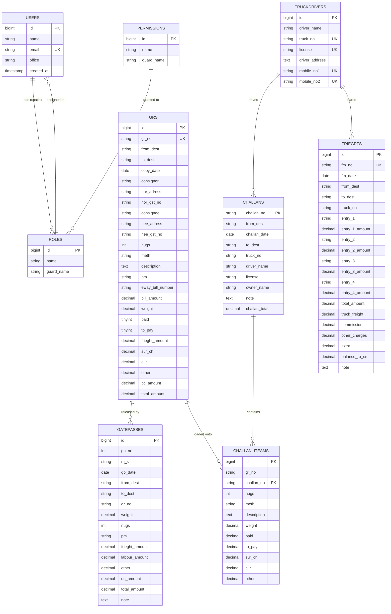

# Database Reconstruction Report — Saurashtra Express

> Source: reverse-engineered from `app/Models/*`, `app/Http/Controllers/*`, `database/migrations/*`, `resources/views/**/*.blade.php`, raw `DB::table(...)` calls.
> Target: MySQL 8 / Laravel 11. All `decimal(x,y)` decisions below are explicit.

---

## 0. Reverse-engineering methodology

For each table I:

1. Read the model file (`app/Models/*.php`) and recorded the `$fillable` array.
2. Read the matching migration (when present) to capture column types and indexes.
3. Read every controller that writes to the table — recorded each `Model::create([...])`, `new Model([...])`, `$model->save()`, and `DB::table('xxx')->insert(...)`.
4. Read every controller that reads the table — recorded every `Model::all()`, `Model::where(...)->get()`, `Model::find($id)`, `Model::latest()->first()`.
5. Read every Blade form that posts to the table — recorded every `<input name="...">` and `<select name="...">`.
6. Read every Blade file that displays the row — recorded every `$row->field` access to catch fields not in `$fillable`.
7. Cross-checked: any field present in the view but missing from the model or migration is flagged as a **ghost field**.
8. Cross-checked: any field present in the controller write but not in the view is a **server-only field** (timestamps, audit).
9. Cross-checked: any field present in the view but missing from the model `$fillable` will be silently dropped by `Model::create()`.

---

## 1. Discovered Tables

The application has **8 application tables + 5 framework/package tables = 13 tables**.

### Application tables
1. `users` (modified by duplicate migration — see §11.1 of project-analysis.md)
2. `posts` (legacy sample)
3. `grs`
4. `gatepasses`
5. `frieghts`
6. `challans`
7. `challan_iteams`
8. `truckdrivers`

### Framework tables
9. `password_resets`
10. `failed_jobs`

### Spatie tables
11. `permissions`
12. `roles`
13. `model_has_permissions`
14. `model_has_roles`
15. `role_has_permissions`

---

## 2. `users`

### 2.1 Current state (legacy)
**Source migration that actually runs:** `2020_11_11_082619_create_users_table.php`.

| Column | Type | Null | Default | Notes |
|---|---|---|---|---|
| `id` | bigint unsigned | NO | auto | PK |
| `name` | varchar(255) | NO | — | |
| `email` | varchar(255) | NO | — | UNIQUE |
| `email_verified_at` | timestamp | YES | NULL | |
| `password` | varchar(255) | NO | — | Mutator `bcrypt()` on `setPasswordAttribute` |
| `office` | varchar(255) | NO | — | **The `office` field is the de-facto tenancy key** |
| `remember_token` | varchar(100) | YES | NULL | |
| `created_at` | timestamp | YES | NULL | |
| `updated_at` | timestamp | YES | NULL | |

### 2.2 Ghost fields / inconsistencies
- **No ghost fields** observed.
- The duplicate migration is a real bug — see `project-analysis.md §11.1`.

### 2.3 Business semantics
- Each user belongs to exactly one office.
- Office list is hard-coded: `Kashmore Gate, Rajkot, Dayabasti, Swarup Nagar, Navagam, Shapar (1), Shapar (2)`.
- The `office` value drives:
  - GR list filter (`GrController::index()`).
  - GR number series (`GrController::create()` — different prefix logic per office).
  - Challan `from_dest` auto-fill.
  - Gatepass `from_dest` auto-fill.
- **No `office` foreign key** to a `branches` table — the value is a free-text string.

### 2.4 Recommended reconstruction
- Promote `office` from a free-text column to a foreign key to a new `branches` table.
- Add `phone`, `is_active`, `last_login_at`, soft-delete (`deleted_at`).
- Add proper index on `office`.
- See `database-reconstruction-report.md §3 (modernized schema)`.

---

## 3. `posts`

### 3.1 Current state
| Column | Type | Notes |
|---|---|---|
| `id` | increments | PK |
| `title` | string | |
| `body` | text | |
| `created_at` | timestamp | |
| `updated_at` | timestamp | |

### 3.2 Business semantics
- Sample/legacy. Used only by `ClearanceMiddleware` permission gates (`Create Post`, `Edit Post`, `Delete Post`).
- No controller file exists (`PostController` is referenced in `routes/web.php` line 101 but the class is missing).
- **Recommendation:** mark for removal in the modernization pass; recreate the controller as a `scaffold` reference or remove the route entirely.

---

## 4. `grs` (Goods Receipt)

### 4.1 Current state
**Migration:** `2020_11_22_053810_cretae_grs_table.php`
**Model:** `app/Models/Gr.php`

| Column | Type (legacy) | Recommended | Why |
|---|---|---|---|
| `id` | bigint unsigned | bigint unsigned | PK |
| `gr_no` | varchar(8) UNIQUE | varchar(20) UNIQUE | Wider — current AA-XXXXX fits, but 8 chars is tight |
| `from_dest` | varchar(13) | varchar(50) | "Kashmore Gate", "Shapar (1)" fit, but 13 is fragile |
| `to_dest` | varchar(13) | varchar(50) | same |
| `copy_date` | string | date | **Type bug** — stored as string, should be `date` |
| `consignor` | string | varchar(150) | |
| `nor_adress` | string (typo, no length) | varchar(255) (rename to `consignor_address`) | |
| `nor_gst_no` | varchar(15) | varchar(15) | |
| `consignee` | string | varchar(150) | |
| `nee_adress` | string (typo, no length) | varchar(255) (rename to `consignee_address`) | |
| `nee_gst_no` | varchar(15) | varchar(15) | |
| `nugs` | int | int | packages count |
| `meth` | string | varchar(10) | `C_R`, `C_B`, `Bags` |
| `description` | text | text | |
| `pm` | string | varchar(50) | payment mode / per-mark |
| `eway_bill_number` | string | varchar(20) | |
| `bill_amount` | decimal (no precision) | decimal(12,2) | |
| `weight` | decimal (no precision) | decimal(10,3) | in kg |
| `paid` | boolean default 0 | tinyint(1) default 0 | |
| `to_pay` | boolean default 0 | tinyint(1) default 0 | |
| `frieght_amount` | decimal | decimal(12,2) | |
| `sur_ch` | decimal | decimal(12,2) | |
| `c_r` | decimal | decimal(12,2) | |
| `other` | decimal | decimal(12,2) | |
| `bc_amount` | decimal | decimal(12,2) | |
| `total_amount` | decimal | decimal(12,2) | |
| `created_at` | timestamp | timestamp | |
| `updated_at` | timestamp | timestamp | |

### 4.2 Ghost fields / inconsistencies
- `copy_date` is stored as `string` but the form sends `d-m-y` (e.g., `05-06-26`) — this is fragile. The `print` view treats it as opaque. **Type must be `date`** going forward.
- `from_dest`, `to_dest` are free-text and should become FKs to a `destinations` (or `branches`) table.
- `gr_no` is the **business number**; we add a separate auto-increment `id` and keep `gr_no` UNIQUE.
- `paid` + `to_pay` are booleans; a real ERP would make this a `payment_mode` enum. (Recommend deferring — see §9.)
- `meth` is a 3-value enum stored as string.

### 4.3 Business semantics — the source-of-truth document
A GR is created at the booking office. The flow:
1. User logs in (office = `Rajkot`).
2. Navigates to `dash/gr/create` → controller picks the next `gr_no` from the per-office series.
3. Form is filled: consignor (with GST), consignee (with GST), packages (nugs + meth), description, weight, E-Way bill no, freight, surcharges, GST (other), BC, total, paid/to-pay.
4. Submit → row inserted into `grs`.
5. A Gatepass is later generated from this GR (with the same `gr_no` as a lookup key).
6. A Challan is later generated that groups multiple GRs onto one truck.

So `grs` is the **parent** of `gatepasses` and `challan_iteams` (cardinality 1-to-many).

### 4.4 Current relationship
- `gatepasses.gr_no` references `grs.gr_no` (string-to-string, no FK declared).
- `challan_iteams.gr_no` references `grs.gr_no` (string-to-string, no FK declared).
- `grs.from_dest` is conceptually the booking office — should FK to `branches`.
- `grs.to_dest` is conceptually the delivery office — should FK to `branches`.

### 4.5 Indexes (recommended)
- PK on `id`
- UNIQUE on `gr_no`
- INDEX on `from_dest` (filter by booking office on every list)
- INDEX on `to_dest` (delivery office filtering)
- INDEX on `copy_date` (date-range reports)
- COMPOSITE INDEX `(from_dest, copy_date)` (most common list query)
- INDEX on `consignor` (search)
- INDEX on `consignee` (search)
- INDEX on `eway_bill_number` (E-Way lookup)

### 4.6 Cardinality expectations
- Per office: ~50–500 GRs/day = ~1M+ rows / 5 years.
- This is the largest table. Index strategy above is critical.

---

## 5. `gatepasses`

### 5.1 Current state
**Migration:** `2020_10_29_082717_create_gatepasses_table.php`
**Model:** `app/Models/gatepass.php`

| Column | Type (legacy) | Recommended | Notes |
|---|---|---|---|
| `id` | bigint unsigned | bigint unsigned | PK |
| `gp_no` | int | int | business number; no UNIQUE |
| `m_s` | string | varchar(150) (rename `consignor`) | the consignor name (text from GR) |
| `gp_date` | string(11) | date | **Type bug** — string |
| `from_dest` | string(13) | varchar(50) | |
| `to_dest` | string(13) | varchar(50) | |
| `gr_no` | string(15) UNIQUE | varchar(20), INDEX, drop UNIQUE | see §11.8 of project-analysis |
| `weight` | int | decimal(10,3) | |
| `nugs` | int | int | |
| `pm` | string | varchar(50) | |
| `frieght_amount` | int | decimal(12,2) | |
| `labour_amount` | int | decimal(12,2) | |
| `other` | int | decimal(12,2) | |
| `dc_amount` | int | decimal(12,2) | |
| `total_amount` | int | decimal(12,2) | |
| `note` | text | text | |
| `created_at` | timestamp | timestamp | |
| `updated_at` | timestamp | timestamp | |

### 5.2 Ghost fields
- `gst_amount` is referenced in the update form (`gate_pass_edit.blade.php` line 156) and in `GatepassController::update()` line 201, but is **not in `$fillable` and not in the table**. Value is dropped.
- `dc_amount` is a column; rename to `delivery_charge` for clarity (optional).

### 5.3 Business semantics
- One Gatepass = one physical delivery release at the destination office.
- It is **created from a GR** — the form pre-fills `gr_no`, `from_dest`, `to_dest`, `consignor` (as `m_s`), `weight`, `nugs`, `frieght_amount`, `other`, `total_amount` from the corresponding GR.
- The user can override `weight`, `nugs`, and the additional charges (`labour_amount`, `dc_amount`).
- GP number increments globally (not per office): `gp_no++; if($gp_no == 1000) $gp_no = 0;` — a fragile auto-reset.

### 5.4 Indexes (recommended)
- PK on `id`
- UNIQUE on `(gp_no, gp_date)` (no two gatepasses on same day with same number)
- INDEX on `gr_no` (lookup from GR)
- INDEX on `gp_date` (date range reports)
- INDEX on `from_dest`, `to_dest`

---

## 6. `frieghts` (Freight Memos)

### 6.1 Current state
**Migration:** `2020_11_08_120739_create_frieghts_table.php`
**Model:** `app/Models/Freight.php`

| Column | Type (legacy) | Recommended | Notes |
|---|---|---|---|
| `id` | bigint unsigned | bigint unsigned | PK |
| `fm_no` | string(10) | varchar(20) | **No UNIQUE** — should be UNIQUE |
| `fm_date` | string(11) | date | **Type bug** — string |
| `from_dest` | string(13) | varchar(50) | |
| `to_dest` | string(13) | varchar(50) | |
| `truck_no` | string(10) | varchar(20) | |
| `entry_1` | string(13) | varchar(150) | charge description (e.g. "Loading") |
| `entry_1_amount` | int | decimal(12,2) | |
| `entry_2` | string(13) | varchar(150) | |
| `entry_2_amount` | int | decimal(12,2) | |
| `entry_3` | string(13) | varchar(150) | |
| `entry_3_amount` | int | decimal(12,2) | |
| `entry_4` | string(13) | varchar(150) | |
| `entry_4_amount` | int | decimal(12,2) | |
| `total_amount` | int | decimal(12,2) | sum of entry amounts |
| `truck_freight` | int | decimal(12,2) | |
| `commission` | int | decimal(12,2) | |
| `other_charges` | int | decimal(12,2) | |
| `extra` | int | decimal(12,2) | |
| `balance_to_sn` | int | decimal(12,2) | "balance to S.N." — settlement balance |
| `note` | text | text | |
| `created_at` | timestamp | timestamp | |
| `updated_at` | timestamp | timestamp | |

### 6.2 Ghost fields
- None. The form `Frieght_memo.blade.php` is built but its `<input>` elements have **no `name` attributes** — so even if `store()` is implemented, no form fields will bind. The Freight module is effectively a **read-only listing** in the current code.

### 6.3 Business semantics
- A Freight Memo is the **settlement document** for a truck: how much the truck owner is owed, less commission, less other charges, leaves the balance to be paid.
- 4 numbered "entries" — these are most likely GRs being settled (or arbitrary charge heads). A real ERP would link the FM to one or more GRs (`fm_id` on `grs` or junction table `freight_memo_grs`).
- `balance_to_sn` = "balance to S.N." (Saurashtra Nagar? probably internal shorthand).
- The "store" controller method is **empty** — the form has no `action` and inputs have no `name` attributes. **This module is non-functional.**

### 6.4 Indexes (recommended)
- PK on `id`
- UNIQUE on `fm_no`
- INDEX on `truck_no`
- INDEX on `fm_date`
- INDEX on `(from_dest, to_dest)`

---

## 7. `challans`

### 7.1 Current state
**Migration:** `2020_12_09_090031_create_challans_table.php`
**Model:** `app/Models/challan.php`

| Column | Type (legacy) | Recommended | Notes |
|---|---|---|---|
| `challan_no` | string UNIQUE | varchar(20) UNIQUE | **PK is the business number, not `id`** |
| `from_dest` | string(13) | varchar(50) | |
| `challan_date` | string | date | **Type bug** — string |
| `to_dest` | string(13) | varchar(50) | |
| `truck_no` | string(20) | varchar(20) | |
| `driver_name` | string | varchar(150) | |
| `license` | string(20) | varchar(20) | |
| `owner_name` | string | varchar(150) | |
| `note` | text | text | nullable |
| `challan_total` | decimal (no precision) | decimal(14,2) | sum of all `challan_iteams` freight |
| `created_at` | timestamp | timestamp | |
| `updated_at` | timestamp | timestamp | |

### 7.2 Ghost fields
- No `id` column. Using `challan_no` as PK works but breaks Laravel conventions (`Model::find($id)` semantics, Eloquent assumes `id`).

### 7.3 Business semantics
- A Challan assigns one truck (with driver and license) to a set of GRs.
- One challan → many `challan_iteams` (each item is one GR).
- `challan_total` is the sum of all `challan_iteams.frieght_amount` (computed).
- Driver name + license are denormalized copies from the `truckdrivers` table — this is a deliberate snapshot, since at the time of dispatch the driver's data should be frozen.

### 7.4 Indexes (recommended)
- PRIMARY KEY on `challan_no`
- INDEX on `truck_no`
- INDEX on `challan_date`
- INDEX on `(from_dest, to_dest)`

---

## 8. `challan_iteams` (Challan Items / Lines)

### 8.1 Current state
**Migration:** `2020_12_06_102452_create_challan_iteams_table.php`
**Model:** `app/Models/ChallanItem.php` (file) / class `ChallanItem`

| Column | Type (legacy) | Recommended | Notes |
|---|---|---|---|
| `id` | bigint unsigned | bigint unsigned | PK |
| `gr_no` | string(8) UNIQUE | varchar(20), INDEX, drop UNIQUE | |
| `challan_no` | string | varchar(20) | |
| `nugs` | int | int | |
| `meth` | string | varchar(10) | |
| `description` | text | text | |
| `weight` | decimal | decimal(10,3) | |
| `paid` | decimal (nullable) | decimal(12,2) nullable | |
| `to_pay` | decimal (nullable) | decimal(12,2) nullable | |
| `sur_ch` | decimal | decimal(12,2) | |
| `c_r` | decimal | decimal(12,2) | |
| `other` | decimal | decimal(12,2) | |
| `created_at` | timestamp | timestamp | |
| `updated_at` | timestamp | timestamp | |

### 8.2 Ghost fields
- The controller uses class `challan_iteam` (singular) — but the class is `ChallanItem`. Fatal error. See §11.3 of project-analysis.

### 8.3 Business semantics
- One challan_iteam = one line of a Challan. The line is "this GR is on this Challan".
- Data is a denormalized snapshot of the corresponding GR at dispatch time. The view `challan.blade.php` AJAX-loads GR fields into the row before saving.

### 8.4 Indexes (recommended)
- PK on `id`
- INDEX on `challan_no`
- INDEX on `gr_no`
- COMPOSITE INDEX `(challan_no, gr_no)` UNIQUE (a GR appears at most once per challan)

---

## 9. `truckdrivers`

### 9.1 Current state
**Migration:** `2020_11_09_095555_create_truckdrivers_table.php`
**Model:** `app/Models/truckdriver.php`

| Column | Type (legacy) | Recommended | Notes |
|---|---|---|---|
| `id` | bigint unsigned | bigint unsigned | PK |
| `driver_name` | string(191) | varchar(150) | |
| `truck_no` | string(20) UNIQUE | varchar(20) UNIQUE | |
| `license` | string(20) UNIQUE | varchar(20) UNIQUE | |
| `driver_address` | string (no length) | text | **Type bug** — should be text |
| `mobile_no1` | string(11) UNIQUE | varchar(15) UNIQUE | |
| `mobile_no2` | string(11) UNIQUE, nullable | varchar(15) UNIQUE nullable | |
| `created_at` | timestamp | timestamp | |
| `updated_at` | timestamp | timestamp | |

### 9.2 Ghost fields
- None.

### 9.3 Business semantics
- One row = one truck (with its assigned driver). The driver is **not** a separate entity; the driver is just a name + license + phones on the truck.
- **Modernization opportunity:** split into `trucks` and `drivers` with a `current_assignment` junction. (Defer — see §11.)

### 9.4 Indexes
- PK on `id`
- UNIQUE on `truck_no`
- UNIQUE on `license`
- UNIQUE on `mobile_no1`
- UNIQUE on `mobile_no2` (nullable)
- INDEX on `driver_name`

---

## 10. Cross-table relationships (current and recommended)

### 10.1 Current (string-to-string, no FK)
```
grs (gr_no) ──< gatepasses (gr_no)
grs (gr_no) ──< challan_iteams (gr_no)
challans (challan_no) ──< challan_iteams (challan_no)
frieghts (truck_no) ──< truckdrivers (truck_no)  [implicit, never joined]
```

### 10.2 Recommended (FK-constrained)
```
branches (id) ──< users (office_id)              -- office becomes a branch FK
branches (id) ──< grs (from_office_id)
branches (id) ──< grs (to_office_id)
branches (id) ──< gatepasses (from_office_id)
branches (id) ──< gatepasses (to_office_id)
branches (id) ──< frieghts (from_office_id)
branches (id) ──< frieghts (to_office_id)
branches (id) ──< challans (from_office_id)
branches (id) ──< challans (to_office_id)
grs (id) ──< gatepasses (gr_id)
grs (id) ──< challan_iteams (gr_id)
challans (challan_no) ──< challan_iteams (challan_no)
truckdrivers (id) ──< frieghts (truck_id)
truckdrivers (id) ──< challans (truck_id)
```

---

## 11. Missing Tables (recommended for modernization)

| Table | Why |
|---|---|
| `branches` | Promote hard-coded office list to first-class entity |
| `destinations` (or reuse `branches`) | `from_dest` / `to_dest` as FKs |
| `customers` (consignee/consignor) | Currently free-text; a real ERP would master them |
| `vendors` (truck owners) | Currently owner_name is free-text on challan |
| `vehicles` (separate from drivers) | A truck can be reassigned to a new driver |
| `drivers` | Currently denormalized on truckdrivers |
| `trips` | A challan is effectively a trip; promote to first-class |
| `pod_uploads` (Proof of Delivery) | Not present; modern logistics requires it |
| `invoices` | Customer billing not present in current code |
| `payments` | Customer receipts not present |
| `vendor_payables` | Freight memo settlement not present |
| `audit_logs` | No auditing exists today |
| `notifications` | App notifications (Laravel standard) |
| `media` (Spatie) | POD images, GR scans, gatepass images |
| `settings` | App-level config (default office, default freight, etc.) |
| `number_sequences` | Replace the hard-coded AA-XXXXX generation with a proper sequence table |

---

## 12. ER Diagram (Mermaid)



---

## 13. Column-type corrections summary

| Table.Column | Legacy type | Recommended | Reason |
|---|---|---|---|
| `grs.copy_date` | string | date | Bug — string date is unsearchable, un-sortable |
| `gatepasses.gp_date` | string(11) | date | same |
| `frieghts.fm_date` | string(11) | date | same |
| `challans.challan_date` | string | date | same |
| `grs.weight` | decimal (no precision) | decimal(10,3) | kg with 3 dp |
| `grs.bill_amount` etc. | decimal (no precision) | decimal(12,2) | INR with 2 dp |
| `truckdrivers.driver_address` | string (no length) | text | addresses can be long |
| `gatepasses.gr_no` | UNIQUE | INDEX | one GR can have multiple gatepasses |
| `challan_iteams.gr_no` | UNIQUE | INDEX | one GR can be on multiple challans |

---

## 14. Pending questions for the user (must be answered before generating final migrations)

1. Do you want a `branches` table to replace the hard-coded `office` string? *(recommended: yes)*
2. Do you want to drop the unique on `gatepasses.gr_no` and `challan_iteams.gr_no`? *(recommended: yes)*
3. Do you want `gr_no` widened from varchar(8) to varchar(20)? *(recommended: yes)*
4. Do you want all `*_date` columns converted to actual `date` type? *(recommended: yes)*
5. Do you want a `number_sequences` table to replace the per-controller increment logic? *(recommended: yes — see `database/migrations_new/2025_01_01_000010_create_number_sequences_table.php`)*
6. Do you want to keep the typo `frieghts` / `challan_iteams`? *(recommended: keep as `freights` / `challan_items`, but add migration aliases for the legacy spelling)*

Defaults above will be applied in the generated migrations under `database/migrations_new/` unless the user objects.
