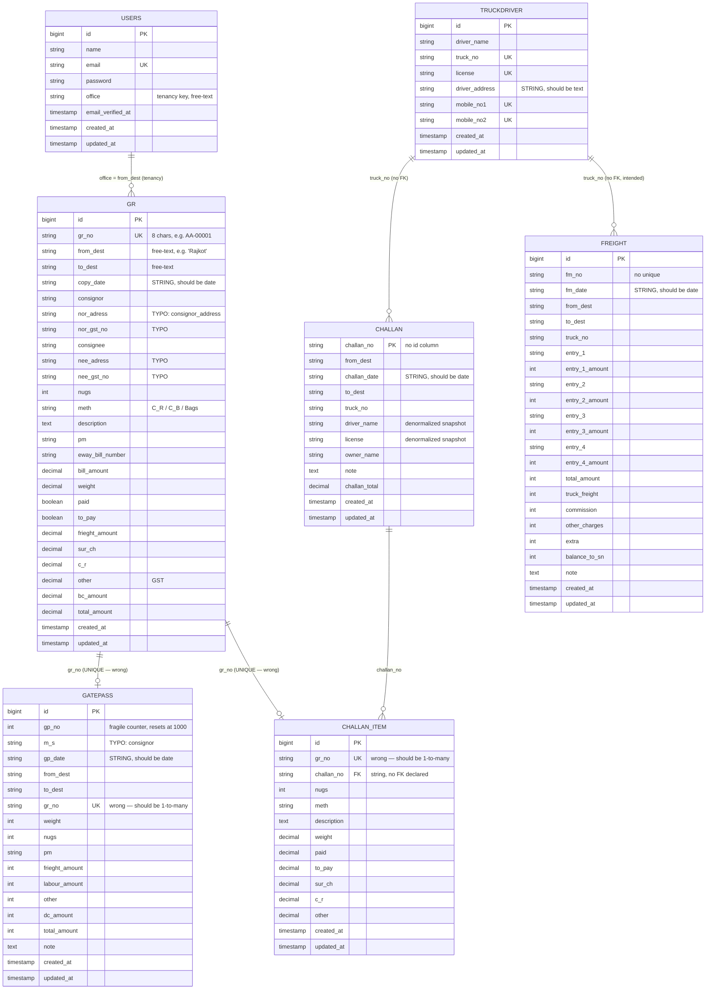
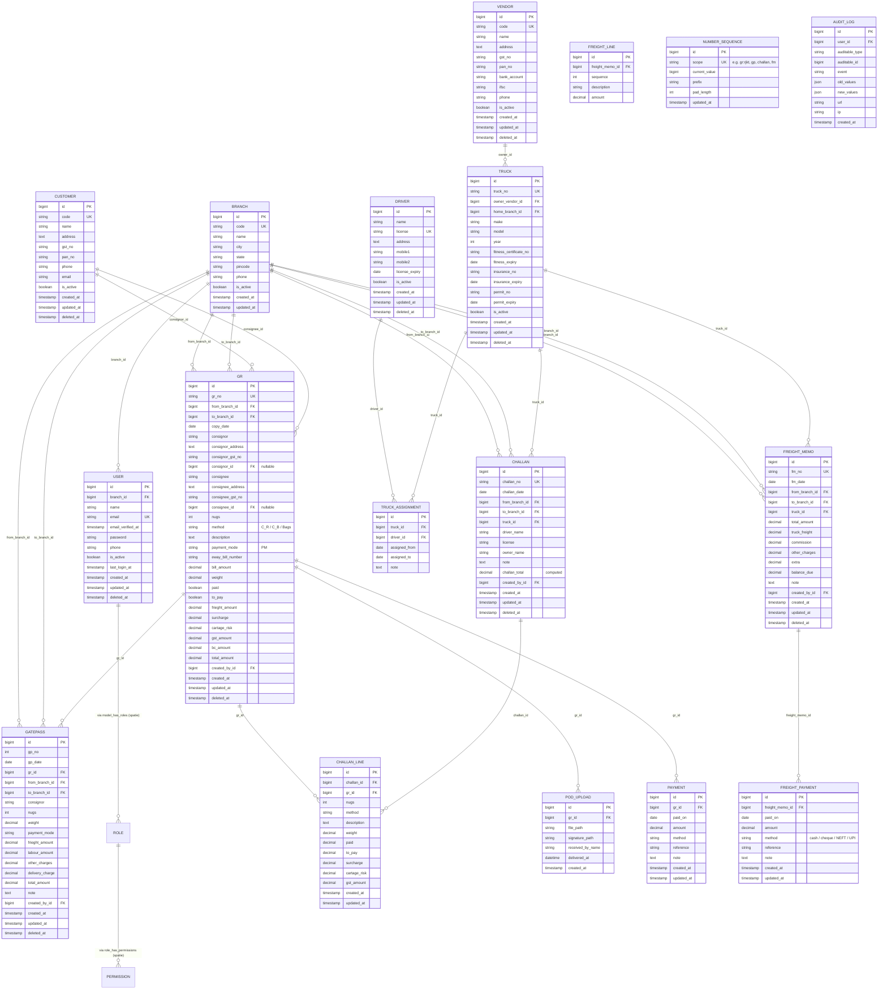

# Entity Relationship Diagram — Saurashtra Express

> Two diagrams:
> 1. **Current state** — exactly what the code describes today (with the bugs and typos preserved)
> 2. **Modernized state** — the target schema for the Laravel 11 + refactored architecture

---

## 1. Current ERD (as the code describes it)

### 1.1 Quick legend
- **PK** = primary key
- **UK** = unique key
- **FK** = foreign key (declared)
- *no FK* = relationship exists only via matching string values

### 1.2 Counts
- Tables: **8 application + 5 framework + 5 Spatie = 18**
- Declared FKs: **6** (all from Spatie)
- Implicit relationships: **7**
- String-typed date columns: **4** (all should be `date`)
- Misspelled columns: **8**

---

## 2. Modernized ERD (target)

---

## 3. Modernization diff summary

| Old | New | Type of change |
|---|---|---|
| `users.office` (string) | `users.branch_id` (FK) | FK + new table |
| `grs.from_dest` (string) | `grs.from_branch_id` (FK) | FK |
| `grs.to_dest` (string) | `grs.to_branch_id` (FK) | FK |
| `grs.nor_adress` (typo) | `grs.consignor_address` | rename |
| `grs.nee_adress` (typo) | `grs.consignee_address` | rename |
| `grs.nor_gst_no` (typo) | `grs.consignor_gst_no` | rename |
| `grs.nee_gst_no` (typo) | `grs.consignee_gst_no` | rename |
| `grs.copy_date` (string) | `grs.copy_date` (date) | type change |
| `gatepasses.m_s` (typo) | `gatepasses.consignor` | rename |
| `gatepasses.gp_date` (string) | `gatepasses.gp_date` (date) | type change |
| `gatepasses.dc_amount` (opaque) | `gatepasses.delivery_charge` | rename |
| `gatepasses.gr_no` (UNIQUE) | `gatepasses.gr_id` (FK, indexed) | proper FK |
| `gatepasses.weight/nugs/frieght_amount` (int) | `gatepasses.weight (decimal(10,3))` etc. | type precision |
| `challans` (no `id`) | `challans.id` (PK) + `challan_no` (UK) | add id |
| `challans.challan_date` (string) | `challans.challan_date` (date) | type change |
| `challan_iteams.gr_no` (UNIQUE) | `challan_iteams.gr_id` (FK, indexed) | proper FK |
| `challan_iteams.challan_no` (string) | `challan_iteams.challan_id` (FK) | proper FK |
| `frieghts` (table) | `freight_memos` (new) + alias view | rename + new |
| `frieghts.fm_date` (string) | `freight_memos.fm_date` (date) | type change |
| `frieghts.balance_to_sn` (opaque) | `freight_memos.balance_due` | rename |
| `frieghts.entry_1..4` (4 columns) | `freight_lines` (separate table) | normalize |
| `truckdrivers` (combined) | `trucks` + `drivers` + `truck_assignments` | split |
| `truckdrivers.truck_no` (UNIQUE) | `trucks.truck_no` (UNIQUE) | move |
| `truckdrivers.license` (UNIQUE) | `drivers.license` (UNIQUE) | move |
| `truckdrivers.driver_address` (string) | `drivers.address` (text) | move + type change |
| — | `customers` | new |
| — | `vendors` | new |
| — | `pod_uploads` | new |
| — | `payments` | new |
| — | `freight_payments` | new |
| — | `number_sequences` | new (replaces fragile per-controller counters) |
| — | `audit_logs` | new |
| — | `branches` | new |
| — | `personal_access_tokens` (sanctum) | new (for future API) |

---

## 4. Indexing plan (modernized)

### 4.1 Critical for scale (millions of GR records)
- `grs.from_branch_id` (filter by office on every list)
- `grs.to_branch_id` (filter by destination)
- `grs.copy_date` (date-range reports)
- `grs.gr_no` (UNIQUE — already)
- `grs.consignor` (search)
- `grs.consignee` (search)
- `grs.eway_bill_number` (lookup)
- COMPOSITE `(grs.from_branch_id, grs.copy_date)` (most common list query)
- COMPOSITE `(grs.to_branch_id, grs.copy_date)` (delivery reports)

### 4.2 Important
- `gatepasses.gr_id`
- `gatepasses.gp_date`
- COMPOSITE `(gatepasses.gp_no, gatepasses.gp_date)` — UNIQUE
- `challans.challan_no` (UNIQUE)
- `challans.challan_date`
- `challans.truck_id`
- `challan_lines.challan_id`
- `challan_lines.gr_id`
- COMPOSITE `(challan_lines.challan_id, challan_lines.gr_id)` — UNIQUE
- `freight_memos.fm_no` (UNIQUE)
- `freight_memos.fm_date`
- `freight_memos.truck_id`
- `trucks.truck_no` (UNIQUE)
- `drivers.license` (UNIQUE)
- `customers.code` (UNIQUE)
- `vendors.code` (UNIQUE)
- `users.email` (UNIQUE)
- `users.branch_id`

---

## 5. Soft-delete strategy

| Table | Soft delete? | Why |
|---|---|---|
| `users` | ✅ | audit, re-activation |
| `grs` | ✅ | regulatory (GR is a financial document) |
| `gatepasses` | ✅ | audit |
| `challans` | ✅ | audit |
| `challan_lines` | ❌ | lives with challan (cascade) |
| `freight_memos` | ✅ | financial |
| `freight_payments` | ❌ | append-only |
| `trucks` | ✅ | audit |
| `drivers` | ✅ | audit |
| `customers` | ✅ | audit |
| `vendors` | ✅ | audit |
| `pod_uploads` | ❌ | immutable |
| `payments` | ❌ | append-only |
| `audit_logs` | ❌ | append-only |
| `branches` | ❌ | never deleted; deactivated via `is_active` |
| `number_sequences` | ❌ | system table |

---

## 6. Audit columns (recommended)

On every business table, add:
- `created_by_id` BIGINT (FK to users, nullable for system-generated)
- `updated_by_id` BIGINT (FK to users, nullable)
- `created_at` TIMESTAMP
- `updated_at` TIMESTAMP
- `deleted_at` TIMESTAMP NULL (if soft delete)

Use Laravel's standard `Auditable` trait (or `spatie/laravel-activitylog`).

---

## 7. What this ERD does NOT cover (out of scope for first modernization pass)

- Multi-company (multi-tenant) isolation — currently single-company (Saurashtra Express). To support multiple companies, add a `companies` table and `branch.company_id`.
- Multi-currency — currently INR-only. To support, add a `currency` column on branch.
- Multi-language — currently English. To support, add JSON `translations` columns.
- API / external integrations — none currently. To support, add `Sanctum` personal access tokens.
