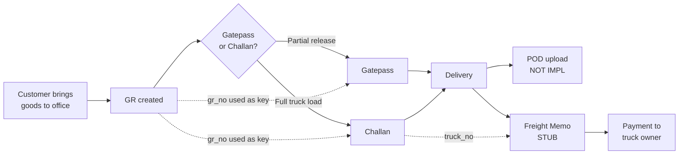

# ERP Workflow Map — Saurashtra Express

> Reverse-engineered from controllers + views. Where a workflow is incomplete, that is documented explicitly.
> Companion: `business-workflows.md` (broader business context).

---

## 0. Master flow (high level)

```
┌──────────────────────────────────────────────────────────────────────┐
│  CUSTOMER brings goods to BOOKING OFFICE (e.g., Rajkot)              │
│                                                                       │
│  ┌────────────────────┐                                               │
│  │ 1. Create GR       │  Controller: GrController@store               │
│  │    (Goods Receipt) │  Table: grs                                   │
│  │    Issues: gr_no   │  Auto-numbers per office (AA-NNNNN)           │
│  └─────────┬──────────┘                                               │
│            │                                                          │
│            ▼                                                          │
│  ┌────────────────────┐                                               │
│  │ 2. Truck arrives   │  Manual / no controller                       │
│  │    to load         │                                               │
│  └─────────┬──────────┘                                               │
│            │                                                          │
│            ▼                                                          │
│  ┌────────────────────┐                                               │
│  │ 3. Create CHALLAN  │  Controller: ChallanController                │
│  │    (Loading list)  │  Tables: challans + challan_iteams            │
│  │    Issues:         │  AJAX-driven line items                       │
│  │    challan_no      │  (gr_id + freight snapshot)                   │
│  └─────────┬──────────┘                                               │
│            │                                                          │
│            ▼                                                          │
│  ┌────────────────────┐                                               │
│  │ 4. Truck departs   │  Manual / out of scope                        │
│  │    to DEST office  │                                               │
│  └─────────┬──────────┘                                               │
│            │                                                          │
│            ▼                                                          │
│  ┌────────────────────┐                                               │
│  │ 5. At DEST office  │  Controller: GatepassController               │
│  │    Create GATEPASS │  Table: gatepasses                            │
│  │    Issues: gp_no   │  Pre-fills from GR                            │
│  └─────────┬──────────┘                                               │
│            │                                                          │
│            ▼                                                          │
│  ┌────────────────────┐                                               │
│  │ 6. Goods delivered │  (POD — NOT IMPLEMENTED)                     │
│  └─────────┬──────────┘                                               │
│            │                                                          │
│            ▼                                                          │
│  ┌────────────────────┐                                               │
│  │ 7. Settlement      │  Controller: FreightController                │
│  │    FREIGHT MEMO    │  Table: frieghts (read-only — stub)           │
│  │    Pays truck owner│                                               │
│  └────────────────────┘                                               │
└──────────────────────────────────────────────────────────────────────┘
```

---

## 1. GR (Goods Receipt) workflow

**Controllers:** `dash\GrController`
**Model:** `Gr` (table `grs`)
**Views:** `admin/category/copies*.blade.php`

### Step-by-step
1. User logs in. Their `users.office` is the booking office (e.g., `"Rajkot"`).
2. User navigates to `GET /dash/gr/create`.
3. `GrController@create()`:
   - Reads the latest `gr_no` from `grs` joined to `users.office = grs.from_dest`.
   - Per-office: Rajkot uses `AA-00001..AA-09999`, then rolls to `AB-00001`. Navagam uses `AA-10001..AA-19999`. Kashmore Gate uses `AA-20001..AA-29999`. Default uses `AA-30001..AA-39999`.
   - Generates the next `gr_no` using string manipulation (`substr($gr_no, 3)` for the numeric part).
   - Returns the `copies` view pre-populated with `new_id` and the current `date('d-m-y')`.
4. User fills the form: from/to office, consignor (with GSTIN), consignee (with GSTIN), nugs, meth, description, weight, E-Way bill no, bill amount, freight, surcharges, GST, BC, total, paid/to-pay.
5. User submits `POST /dash/gr/store`.
6. `GrController@store()`:
   - Validates inline.
   - Inserts into `grs` (note: `Gr` is referenced as `Gr\` in `new Gr\([...])` — this is PHP namespace resolution for the root, and works only if `Gr` is the class name).
   - Redirects to `dash/gr` with success flash.
7. The new GR appears in `GET /dash/gr` filtered by `Auth::user()->office`.
8. Edit (`/dash/gr/{id}/edit`) and Update (`PATCH /dash/gr/{id}/update`) follow the same validation.
9. Delete (`DELETE /dash/gr/{id}/delete`) deletes the row.
10. Print (`GET /dash/gr/{id}/print`) returns the print-formatted `copies_print.blade.php`.

### Reports
- **None.** The `GET /dash/gr` listing is the only "report". No PDF export, no Excel export, no aggregates.

### Data flow
```
grs.gr_no         ← generated by GrController
grs.from_dest     ← form select (office list)
grs.to_dest       ← form select
grs.copy_date     ← form text input (d-m-y format)
grs.consignor     ← form text
grs.consignee     ← form text
grs.*_amount      ← form numeric
```

### Issues
- See `project-analysis.md §11.6` (duplicate `from_dest` select).
- See `ghost-field-audit.md §2.1–2.4` (column naming typos).
- `date('d-m-y')` is a fragile format. Should be `date('Y-m-d')` and column type `date`.

---

## 2. Gatepass workflow

**Controllers:** `dash\GatepassController`
**Model:** `gatepass` (table `gatepasses`)
**Views:** `admin/category/Gatepass/gate_pass*.blade.php`

### Step-by-step
1. After a GR is created, a delivery is to be made at the destination office.
2. User at the dest office navigates to `GET /dash/gatepass/create?gr_no=AA-00001`.
3. `GatepassController@create()`:
   - Increments a global `gp_no` counter (resets at 1000 — see `project-analysis.md §11.14`).
   - Looks up the GR via `DB::table('grs')->where('gr_no', $gr_no)->first()`.
   - Renders the form pre-filled with GR data.
4. User confirms/adjusts weight, nugs, freight, labour, other, DC, total, and adds a note.
5. `POST /dash/gatepass/store` validates and inserts.
6. Edit/Update/Delete work analogously.
7. `GET /dash/gatepass/{id}/print` reuses `copies_print.blade.php` (yes — the **Gatepass prints using the GR print template**, with a few fields blank).

### Reports
- **None** dedicated.

### Data flow
```
gatepasses.gp_no       ← generated, fragile counter
gatepasses.gr_no       ← manual input (or pre-fill from ?gr_no=)
gatepasses.from_dest   ← from GR
gatepasses.to_dest     ← from GR
gatepasses.m_s         ← from GR.consignor
gatepasses.weight      ← user-editable override
gatepasses.nugs        ← user-editable override
gatepasses.*_amount    ← user-editable
```

### Issues
- `gst_amount` ghost in update form (`ghost-field-audit.md §1.2`).
- `gp_no` counter collision at 1000.
- `gr_no` UNIQUE prevents one-to-many (split deliveries).
- Print template is the GR's, not a Gatepass-specific one.

---

## 3. Challan workflow

**Controllers:** `dash\ChallanController`
**Models:** `challan` (table `challans`), `ChallanItem` (table `challan_iteams`)
**Views:** `admin/category/challan/challan*.blade.php`

### Step-by-step
1. Truck is ready to load at the booking office. User goes to `GET /dash/challan/create?truck_no=GJ05AB1234`.
2. `ChallanController@create()`:
   - Auto-generates `challan_no` (AA-NNNN, increments globally, rolls at 1001 to AB-0001).
   - Looks up the truck via `DB::table('truckdrivers')->where('truck_no', $truck_no)->first()` — but **does not use** the returned data to pre-fill. The form fills it manually.
   - Renders the challan form.
3. User fills challan header (date, from, to, truck, driver, license, owner, note).
4. User adds GRs to the challan one by one via AJAX:
   - Type a `gr_no` into the row.
   - `GET /dash/challan/{gr_no}/getData` returns the GR data as JSON (`{data: {...}}`).
   - The form auto-fills `nugs, meth, description, weight, paid, to_pay, sur_ch, c_r, other`.
   - User clicks "Add" → `POST /dash/challan/challanIteams` → `challan_iteam::insert($request->all())` (no validation!).
5. After all GRs are added, user clicks "Save Challan" → `POST /dash/challan/store` → `challan::insert($request->all())` (no validation!).
6. `GET /dash/challan` lists all challans.

### Reports
- **None** dedicated.

### Data flow
```
challans.challan_no    ← generated
challans.challan_date  ← form input (string, should be date)
challans.from_dest     ← form input
challans.to_dest       ← form input
challans.truck_no      ← form input
challans.driver_name   ← form input (denormalized from truckdrivers)
challans.license       ← form input (denormalized)
challans.owner_name    ← form input
challans.challan_total ← computed: sum of frieght_amount of items
challan_iteams.*       ← per-row, snapshot of GR
```

### Issues
- **CRITICAL:** `use App\Models\challan_iteam;` — class does not exist. The controller will throw on any call (`index`, `store`, etc.).
- No validation on `store()` — arbitrary input is inserted.
- `challan_total` is a stored column but should be a computed attribute.
- `gr_no` UNIQUE on `challan_iteams` prevents the same GR from appearing on a return / re-dispatch challan.
- Print uses the GR template (no dedicated challan print exists).

---

## 4. Freight Memo workflow

**Controllers:** `dash\FreightController`
**Model:** `Freight` (table `frieghts`)
**Views:** `admin/category/FrieghtMemo/Frieght_memo*.blade.php`

### Step-by-step
1. After delivery, the truck owner is to be paid.
2. User goes to `GET /dash/frieghtmemo/create`.
3. `FreightController@create()`:
   - Loads the truck dropdown via `TruckDriver::pluck('truck_no','id')`.
   - Renders the form.
4. User fills the form (4 charge entries + truck freight + commission + other + extra + balance to S.N.).
5. `POST /dash/frieghtmemo/store` → **stub**, does nothing.
6. The form's inputs lack `name` attributes (see `ghost-field-audit.md §3` / `form-field-map.md §7`) so even if `store()` were implemented, no data would be posted.

### Status: NON-FUNCTIONAL.

### Issues
- Form not bound to model fields.
- Controller `store/update/destroy` are empty.
- View `edit` is also unbound.
- No print template.

---

## 5. Truck/Driver workflow

**Controllers:** `TruckdriverController`
**Model:** `truckdriver` (table `truckdrivers`)
**Views:** `admin/category/TruckDriver/truck_driver*.blade.php`

### Step-by-step
1. Admin goes to `GET /dash/truckdriver`.
2. Lists all trucks (`truckdriver::all()`).
3. `GET /dash/truckdriver/create` → form with regex-validated truck no + license.
4. `POST /dash/truckdriver/store` → validates → inserts.
5. Edit/Update/Delete work as standard.
6. `GET /dash/truckdriver/{id}/view` shows details (a view, not a print).

### Status: WORKING.

### Issues
- Redirect URL `admin/back/truckdriver` (in `store/update/destroy`) is wrong — should be `dash/truckdriver`. This is a 302 to a non-existent route; the user lands on a 404.
- `truck_no` + `license` + `mobile_no1` are UNIQUE — see `project-analysis.md §11.13`.

---

## 6. Authentication workflow

**Controllers:** `Auth/*` (default Laravel 8 stack)
**Model:** `User` (table `users`)
**Views:** `auth/*`

### Step-by-step
1. `GET /` → `view('auth.login')` (the root route is overridden).
2. User submits credentials → `Auth\LoginController@login`.
3. On success, redirected to `/dash`.
4. Logout via `Auth\LoginController@logout`.

### Status: WORKING (untouched default).

---

## 7. Admin: Users / Roles / Permissions workflow

Standard Spatie RBAC. CRUD on each, role assignment on user, permission sync on role.

### Status: WORKING.

### Issues
- `AdminMiddleware` first-user bootstrap is fragile (see `ghost-field-audit.md §6.3`).

---

## 8. Reporting workflow

There is no reporting workflow. The application's "reports" are simply the listing pages (e.g., `GET /dash/gr`).

To get a true report (e.g., GR register between two dates, or revenue per office), the user must export the listing via the browser's "Print → Save as PDF" function. There is no PDF library (DomPDF, Snappy) in the codebase.

---

## 9. Settlement workflow

**Not implemented.** `freight_memos` is a stub. The intent (from column names) is:
- Truck owner delivers goods.
- Office settles the truck: total amount = sum of GR freight on the truck. Less commission. Less other charges. Add extras. Balance to be paid = result.

A real implementation would have:
- `freight_memos` (the document) linked to a `challans` (the trip).
- Payment records: `freight_payments` (cash/cheque/NEFT).
- Outstanding balance report.

See `business-workflows.md §7` for the proposed settlement flow.

---

## 10. POD (Proof of Delivery) workflow

**Not implemented.** No `pod_uploads` table. No upload UI. The print template has a placeholder comment `<!-- put code of barcode here -->` on line 64 of `copies_print.blade.php`.

---

## 11. Cross-module data movement



---

## 12. Workflow confidence matrix

| Workflow | Functional? | Confidence |
|---|---|---|
| GR create / edit / delete / print | ✅ Yes | 100% |
| Gatepass create / edit / delete | ✅ Yes | 100% |
| Gatepass print | ⚠️ Uses wrong template (GR print) | 100% |
| Challan list | ❌ **Broken** (use statement typo) | 100% |
| Challan create | ❌ **Broken** (use statement typo) | 100% |
| Challan edit | ❌ **Broken** (use statement typo) | 100% |
| Challan print | ❌ No template | 100% |
| Freight Memo any operation | ❌ **Stub** (no name attributes + empty store) | 100% |
| Truck/Driver full CRUD | ✅ Yes (with broken redirect URL) | 100% |
| Auth | ✅ Yes | 100% |
| Admin (Users/Roles/Permissions) | ✅ Yes | 100% |
| Settlement | ❌ Not implemented | 100% |
| POD | ❌ Not implemented | 100% |
| Reports / Exports | ❌ Not implemented | 100% |
