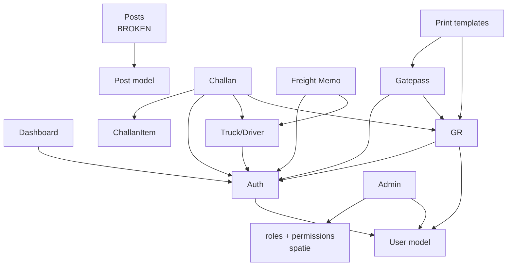

# Module Map — Saurashtra Express

> Dependency graph between modules. Static scan of `use` statements, route definitions, view `@extends`/`@include`, and controller constructor injections.

---

## 1. Module list (10)

| # | Module | Files | Entry route |
|---|---|---|---|
| 1 | Auth | `app/Http/Controllers/Auth/*` | `Auth::routes()` |
| 2 | Admin (Users/Roles/Perms) | `UserController`, `RoleController`, `PermissionController` | `/dash/users`, `/dash/roles`, `/dash/permissions` |
| 3 | Dashboard | `dash/DashboardController` | `/dash` |
| 4 | GR | `dash/GrController` + `Gr` model | `/dash/gr` |
| 5 | Gatepass | `dash/GatepassController` + `gatepass` model | `/dash/gatepass` |
| 6 | Challan | `dash/ChallanController` + `dash/ChallanItemController` + `challan`, `ChallanItem` models | `/dash/challan` |
| 7 | Freight Memo | `dash/FreightController` + `Freight` model | `/dash/frieghtmemo` |
| 8 | Truck/Driver | `TruckdriverController` + `truckdriver` model | `/dash/truckdriver` |
| 9 | Posts (sample) | `Post` model + (missing controller) | `/dash/posts` |
| 10 | Print | (no controller; reused by GR and Gatepass) | `/dash/gr/{id}/print`, `/dash/gatepass/{id}/print` |

---

## 2. Module dependency graph



---

## 3. Coupling table

| Module | Depends on | Tightness | Notes |
|---|---|---|---|
| Auth | User, Spatie | Medium | Standard Laravel auth stack |
| Admin | Auth, User, Spatie | Medium | Standard Spatie pattern |
| Dashboard | Auth (via constructor), Layout | Loose | Empty stub |
| GR | User (via `Auth::user()->office`), Layout | **Tight** | Number generation is hard-coded in controller (should be a service) |
| Gatepass | GR (via `gr_no` lookup), Auth | Medium | No formal coupling — just `DB::table` |
| Challan | GR (via AJAX), Truck/Driver, Auth | **Tight** | Snapshot data flow — duplicating fields from GR and Truck |
| Freight Memo | Truck/Driver, Auth | Loose | No real data flow (form is unbound) |
| Truck/Driver | Auth | Loose | Self-contained |
| Posts | (broken) | — | No controller exists |

---

## 4. Module health summary

| Module | Functional | Print | Reports | Testable | Migrations |
|---|---|---|---|---|---|
| Auth | ✅ | — | — | ⚠️ | ✅ |
| Admin | ✅ | — | — | ⚠️ | ✅ |
| Dashboard | ❌ (empty) | — | — | — | — |
| GR | ✅ | ⚠️ (broken logo) | ❌ | ❌ | ⚠️ (no down) |
| Gatepass | ⚠️ (gst bug) | ⚠️ (wrong template) | ❌ | ❌ | ✅ |
| Challan | ❌ (use statement typo) | ❌ (no template) | ❌ | ❌ | ✅ |
| Freight Memo | ❌ (stub) | ❌ | ❌ | ❌ | ✅ |
| Truck/Driver | ✅ (bad redirect) | ✅ (view page) | ❌ | ❌ | ✅ |
| Posts | ❌ (no controller) | — | — | — | ✅ |
| Print | — | ⚠️ (shared, broken) | — | — | — |

---

## 5. Data flow (textual)

### 5.1 GR creation
```
Auth::user()->office  ──→ GrController@create  ──→ DB::table('grs')->latest()
                                                  ──→ GrController@store  ──→ INSERT INTO grs
```

### 5.2 Gatepass from GR
```
GET /dash/gatepass/create?gr_no=AA-00001
   ↓
GatepassController@create  ──→ DB::table('grs')->where('gr_no',$gr_no)->first()
   ↓
view('admin.category.Gatepass.gate_pass', ['gr' => $row, 'date' => today, 'gp_no' => next])
   ↓
POST /dash/gatepass/store
   ↓
GatepassController@store  ──→ INSERT INTO gatepasses
```

### 5.3 Challan (AJAX-driven)
```
GET /dash/challan/create?truck_no=GJ05AB1234
   ↓
ChallanController@create  ──→ DB::table('truckdrivers')->where('truck_no',...)
                            (returns challan_no generation only)
   ↓
User types gr_no into a row → GET /dash/challan/{gr_no}/getData
   ↓
ChallanController@getData  ──→ gr::where('gr_no',$gr_no)->first()
   ↓
JSON: { data: {...} }  →  form auto-fills row
   ↓
User clicks "Add" → POST /dash/challan/challanIteams
   ↓
challan_iteam::insert($request->all())   ← no validation
   ↓
User clicks "Save Challan" → POST /dash/challan/store
   ↓
challan::insert($request->all())   ← no validation
```

### 5.4 Truck/Driver (standard CRUD)
```
TruckdriverController@store
   ↓
$request->validate([...regex rules...])
   ↓
new truckdriver([...])  → save()  → INSERT
   ↓
Redirect('admin/back/truckdriver')   ← broken redirect (typo)
```

---

## 6. Cross-module field duplication

These fields are duplicated across multiple tables because each table is a snapshot:

| Field | GR | Gatepass | Challan | ChallanItem |
|---|---|---|---|---|
| `gr_no` | ✅ | ✅ | — | ✅ |
| `from_dest` | ✅ | ✅ | ✅ | — |
| `to_dest` | ✅ | ✅ | ✅ | — |
| `consignor` | ✅ | ✅ (`m_s`) | — | — |
| `weight` | ✅ | ✅ | — | ✅ |
| `nugs` | ✅ | ✅ | — | ✅ |
| `frieght_amount` | ✅ | ✅ | — | ✅ |
| `sur_ch` | ✅ | — | — | ✅ |
| `c_r` | ✅ | — | — | ✅ |
| `other` | ✅ | ✅ | — | ✅ |
| `total_amount` | ✅ | ✅ | ✅ (`challan_total`) | — |

This duplication is **intentional** for the Gatepass (additional delivery charges are added) and for the ChallanItem (frozen snapshot at dispatch time).

For the modernization, we keep the duplication (it's correct) but introduce FKs to the GR for traceability.

---

## 7. Spatie module

| Aspect | Status |
|---|---|
| Installed | ✅ |
| Migrations published | ✅ (`2020_10_22_120538_create_permission_tables.php`) |
| Tables present in DB | 5 (roles, permissions, model_has_roles, model_has_permissions, role_has_permissions) |
| `User` uses `HasRoles` | ✅ |
| Default permissions observed | `Administer roles & permissions`, `Create Post`, `Edit Post`, `Delete Post` |
| Admin UI implemented | ✅ (User, Role, Permission controllers) |
| Business modules using Spatie | ❌ **None** (no business module uses `can()` or `hasPermissionTo()`) |

This means the RBAC system is in place but **not enforced** on any business endpoint.

---

## 8. Layout / frontend module

| Layout | Used by | Notes |
|---|---|---|
| `admin/layout/master.blade.php` | All `/dash/*` pages | Wraps top, navigation, header, content, bottom |
| `layouts/app.blade.php` | Nothing | Unused default Laravel layout |
| `welcome.blade.php` | Nothing | Default landing page (overridden by `routes/web.php` line 17) |
| `home.blade.php` | Auth\HomeController | Unused (the root route overrides to `auth.login`) |

The admin layout is the single point of frontend consistency. It is server-rendered HTML with embedded CSS classes from a third-party admin theme (likely AdminLTE based on the `webfonts/` and `js/` directories).
