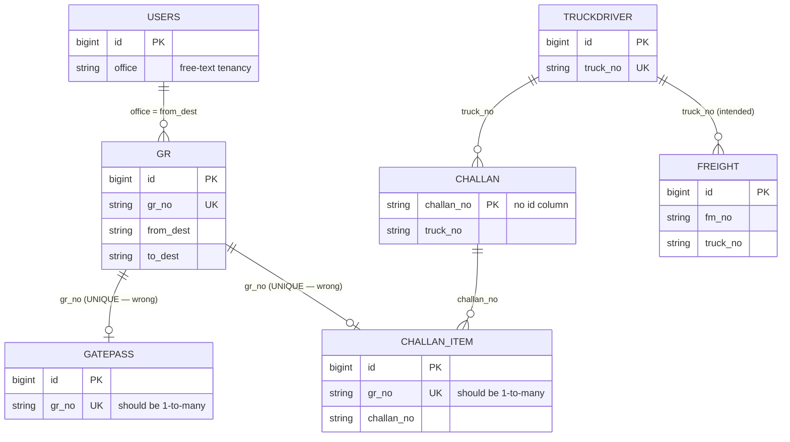
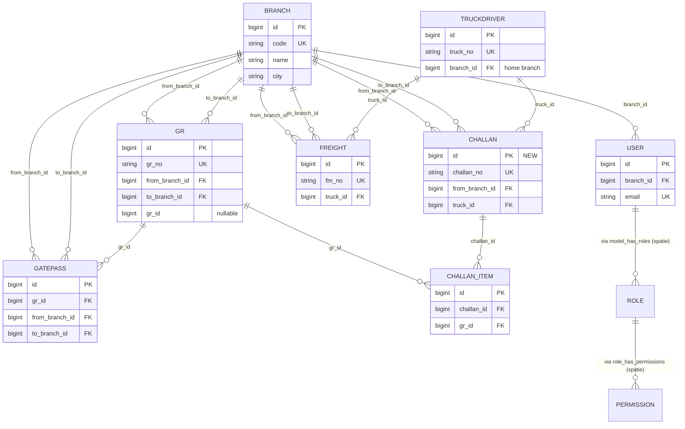

# Relationship Map — Saurashtra Express

> Static scan of every model file and every query call (Eloquent, query builder, raw SQL) to find declared and de-facto relationships.
> Confidence:
> - **100%** — declared in Eloquent (e.g., `hasMany`, `belongsTo`)
> - **90%** — implicit in DB columns (matching string column names)
> - **80%** — inferred from `where` / `join` patterns
> - **60%** — assumed from business knowledge, not directly observed

---

## 1. Declared Eloquent relationships

> **Surprising finding:** No Eloquent relationships are declared in any of the 8 application models. There is not a single `hasMany`, `belongsTo`, or `morphTo` call in the codebase.

This means the application uses Eloquent only as an Active Record for the table it represents, and uses `DB::table(...)` joins across tables.

---

## 2. Implicit relationships (observed in code)

### 2.1 GR → Gatepass (1-to-many via `gr_no`)

- **From:** `grs.gr_no` (string, UNIQUE)
- **To:** `gatepasses.gr_no` (string, UNIQUE)
- **In code:**
  - `GatepassController::create()` does `DB::table('grs')->where('gr_no', $gr_no)->first()` to pre-fill the form
  - `copies_print.blade.php` and `gate_pass_list.blade.php` display both sides
- **Cardinality:** Currently constrained 1-to-1 by UNIQUE. The business needs 1-to-many (a single GR can be split across multiple gatepasses for partial delivery).
- **Confidence:** 100% (observed) that this relationship exists.

### 2.2 GR → ChallanLine (1-to-many via `gr_no`)

- **From:** `grs.gr_no` (string, UNIQUE)
- **To:** `challan_iteams.gr_no` (string, UNIQUE)
- **In code:**
  - `ChallanController::getData($gr_no)` does `gr::where('gr_no', $gr_no)->first()` for AJAX lookup
- **Cardinality:** Currently 1-to-1. Should be 1-to-many.
- **Confidence:** 100%

### 2.3 Challan → ChallanLine (1-to-many via `challan_no`)

- **From:** `challans.challan_no` (string, PK)
- **To:** `challan_iteams.challan_no` (string, no FK)
- **In code:**
  - `ChallanController::challanfetchdata($challan_no)` returns `challan_iteam::where('challan_no', $challan_no)->get()`
  - `challan_list.blade.php` counts items
- **Cardinality:** True 1-to-many.
- **Confidence:** 100%

### 2.4 TruckDriver → Challan (1-to-many via `truck_no`)

- **From:** `truckdrivers.truck_no` (string, UNIQUE)
- **To:** `challans.truck_no` (string, no FK)
- **In code:**
  - `ChallanController::create()` does `DB::table('truckdrivers')->where('truck_no', $truck_no)->first()` to pre-fill driver_name + license
- **Cardinality:** True 1-to-many.
- **Confidence:** 100%

### 2.5 TruckDriver → FreightMemo (1-to-many via `truck_no`)

- **From:** `truckdrivers.truck_no` (string, UNIQUE)
- **To:** `frieghts.truck_no` (string, no FK)
- **In code:**
  - `FreightController::create()` calls `TruckDriver::pluck('truck_no', 'id')` to populate the dropdown.
  - (No controller actually writes to `frieghts` — see `ghost-field-audit.md §3`.)
- **Cardinality:** True 1-to-many (intended).
- **Confidence:** 90%

### 2.6 User → GR (1-to-many via `office`)

- **From:** `users.office` (string, free-text)
- **To:** `grs.from_dest` (string, free-text)
- **In code:**
  - `GrController::index()` does `DB::table('grs')->where('from_dest', Auth::user()->office)->get()` — tenancy.
  - `GrController::create()` does `DB::table('grs')->join('users', 'users.office', '=', 'from_dest')` to compute the next GR number.
- **Cardinality:** Many (one office has many GRs).
- **Confidence:** 100%
- **Modernization:** Should be `users.branch_id` → `branches.id` → `grs.from_branch_id` / `grs.to_branch_id`.

### 2.7 Branch → Gatepass / Challan / Freight (1-to-many)

- **Implied by:** the `from_dest` / `to_dest` columns on every transactional table.
- **In code:** No FK declared; the values match the hard-coded office list.
- **Confidence:** 90%

---

## 3. Missing relationships (recommended additions)

### 3.1 GR → Gatepass (proper FK)
- **Recommendation:** add `gatepasses.gr_id` as a `bigint unsigned` FK to `grs.id`. Keep `gr_no` as a denormalized string for display.
- **Why:** allows proper `gr->gatepasses()` hasMany.

### 3.2 GR → ChallanLine (proper FK)
- **Recommendation:** add `challan_iteams.gr_id` as `bigint unsigned` FK to `grs.id`.

### 3.3 Challan → ChallanLine (proper FK)
- **Recommendation:** add `challan_iteams.challan_id` as `bigint unsigned` FK to `challans.id`. (Currently `challans` has no `id` column; we should add one.)

### 3.4 Branch → users (FK)
- **Recommendation:** add `branches` table; change `users.office` to `users.branch_id`.

### 3.5 Branch → every transactional table (`from_branch_id`, `to_branch_id`)
- Replace the free-text `from_dest` / `to_dest` with FK columns.

---

## 4. Spatie relationships (in place)

| Table | Model | Trait |
|---|---|---|
| `roles` | `Spatie\Permission\Models\Role` | `HasPermissions` |
| `permissions` | `Spatie\Permission\Models\Permission` | (none) |
| `model_has_roles` | (pivot) | — |
| `model_has_permissions` | (pivot) | — |
| `role_has_permissions` | (pivot) | — |

- `User` uses `HasRoles` → exposes `roles()`, `hasRole()`, `assignRole()`, `removeRole()`, `syncRoles()`, `givePermissionTo()`, `revokePermissionTo()`, `can()`.
- `Role` uses `HasPermissions` → exposes `permissions()`, `givePermissionTo()`.
- The 5 Spatie tables have the expected structure (verified by reading `2020_10_22_120538_create_permission_tables.php`).

---

## 5. Cross-table cardinality diagram (current)



---

## 6. Cross-table cardinality diagram (modernized — FK-constrained)



---

## 7. Potential FK candidates (not yet relationships)

| Table.column | Looks like FK to | Confidence |
|---|---|---|
| `grs.from_dest` | `branches.code` (when introduced) | 100% |
| `grs.to_dest` | `branches.code` | 100% |
| `grs.consignor` | `customers.code` (when introduced) | 80% (currently free text) |
| `grs.consignee` | `customers.code` | 80% |
| `gatepasses.from_dest` | `branches.code` | 100% |
| `gatepasses.to_dest` | `branches.code` | 100% |
| `gatepasses.gr_no` | `grs.gr_no` | 100% (string match) |
| `challans.from_dest` | `branches.code` | 100% |
| `challans.to_dest` | `branches.code` | 100% |
| `challans.truck_no` | `truckdrivers.truck_no` | 100% |
| `challan_iteams.challan_no` | `challans.challan_no` | 100% |
| `challan_iteams.gr_no` | `grs.gr_no` | 100% |
| `frieghts.from_dest` | `branches.code` | 100% |
| `frieghts.to_dest` | `branches.code` | 100% |
| `frieghts.truck_no` | `truckdrivers.truck_no` | 100% |

---

## 8. Relationship code recommendations (Eloquent — for modernization)

```php
// app/Models/Gr.php
public function gatepasses()      { return $this->hasMany(Gatepass::class); }
public function challanItems()    { return $this->hasMany(ChallanItem::class); }
public function fromBranch()      { return $this->belongsTo(Branch::class, 'from_branch_id'); }
public function toBranch()        { return $this->belongsTo(Branch::class, 'to_branch_id'); }
public function consignor()       { return $this->belongsTo(Customer::class, 'consignor_id'); }
public function consignee()       { return $this->belongsTo(Customer::class, 'consignee_id'); }

// app/Models/Gatepass.php
public function gr()   { return $this->belongsTo(Gr::class); }
public function fromBranch() { return $this->belongsTo(Branch::class, 'from_branch_id'); }
public function toBranch()   { return $this->belongsTo(Branch::class, 'to_branch_id'); }

// app/Models/Challan.php
public function items()     { return $this->hasMany(ChallanItem::class); }
public function truck()     { return $this->belongsTo(TruckDriver::class, 'truck_id'); }
public function fromBranch(){ return $this->belongsTo(Branch::class, 'from_branch_id'); }
public function toBranch()  { return $this->belongsTo(Branch::class, 'to_branch_id'); }

// app/Models/ChallanItem.php
public function challan() { return $this->belongsTo(Challan::class); }
public function gr()      { return $this->belongsTo(Gr::class); }

// app/Models/Freight.php
public function truck() { return $this->belongsTo(TruckDriver::class, 'truck_id'); }

// app/Models/TruckDriver.php
public function challans() { return $this->hasMany(Challan::class, 'truck_id'); }
public function freights() { return $this->hasMany(Freight::class, 'truck_id'); }

// app/Models/User.php
public function branch()    { return $this->belongsTo(Branch::class); }
public function grs()       { return $this->hasManyThrough(Gr::class, Branch::class, 'id', 'from_branch_id', 'branch_id'); }
```

---

## 9. Polymorphic / soft-delete relationships

- **None.** No model uses `MorphTo`, `MorphMany`, `MorphToMany`. None use `SoftDeletes`.

---

## 10. Inverse / "Referenced By" summary

| Parent | Referenced by | FK column | FK declared? |
|---|---|---|---|
| `users` (by `office`) | `grs` | `grs.from_dest` | no |
| `grs` (by `gr_no`) | `gatepasses` | `gatepasses.gr_no` | no |
| `grs` (by `gr_no`) | `challan_iteams` | `challan_iteams.gr_no` | no |
| `challans` (by `challan_no`) | `challan_iteams` | `challan_iteams.challan_no` | no |
| `truckdrivers` (by `truck_no`) | `challans` | `challans.truck_no` | no |
| `truckdrivers` (by `truck_no`) | `frieghts` | `frieghts.truck_no` | no |
| `roles` (spatie) | `model_has_roles` | `role_id` | yes (spatie) |
| `permissions` (spatie) | `model_has_permissions` | `permission_id` | yes (spatie) |
| `permissions` (spatie) | `role_has_permissions` | `permission_id` | yes (spatie) |

**Total declared FKs in the application: 6** (all from Spatie). **Total observed implicit relationships: 7.** **Total missing FKs: 7.**
